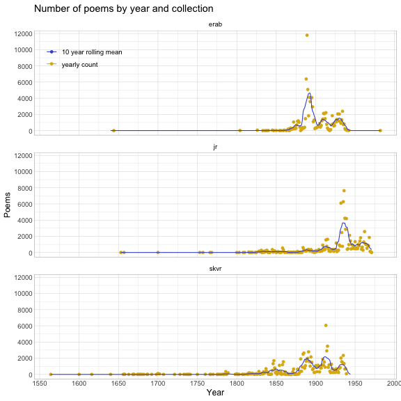
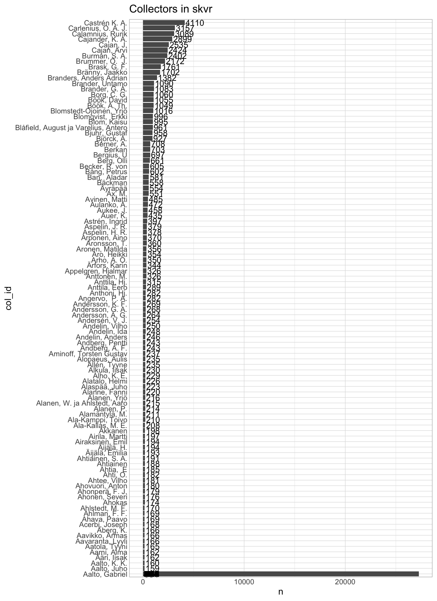
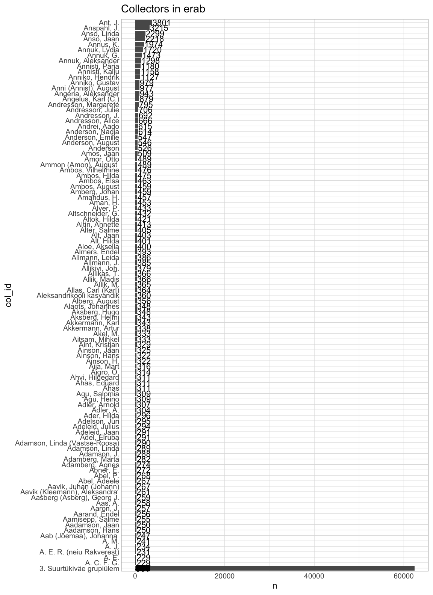
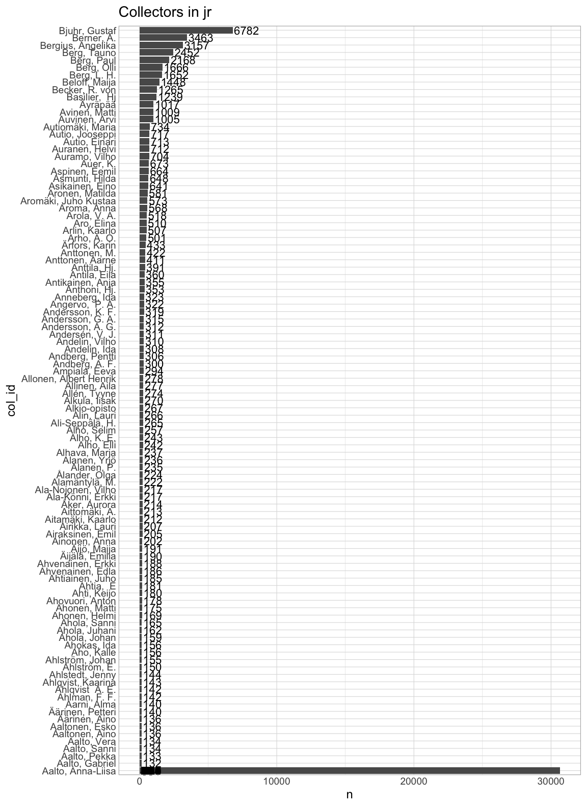
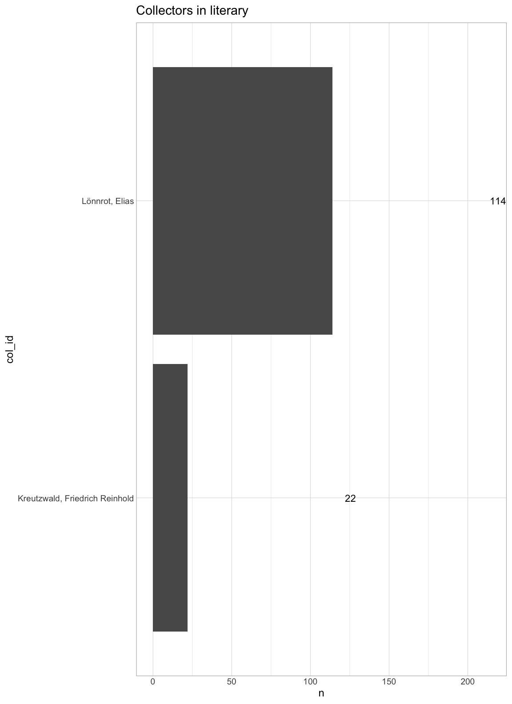
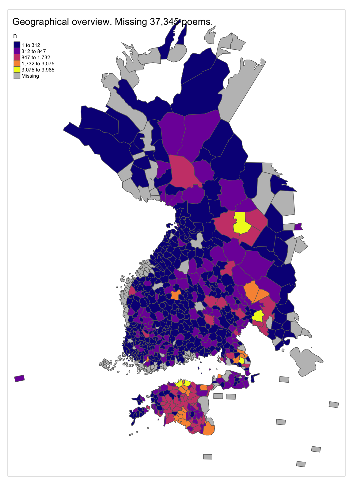

# Temporal overview



<!--html_preserve--><div id="tznkipceox" style="overflow-x:auto;overflow-y:auto;width:auto;height:auto;">
<style>html {
  font-family: -apple-system, BlinkMacSystemFont, 'Segoe UI', Roboto, Oxygen, Ubuntu, Cantarell, 'Helvetica Neue', 'Fira Sans', 'Droid Sans', Arial, sans-serif;
}

#tznkipceox .gt_table {
  display: table;
  border-collapse: collapse;
  margin-left: auto;
  margin-right: auto;
  color: #333333;
  font-size: 16px;
  font-weight: normal;
  font-style: normal;
  background-color: #FFFFFF;
  width: auto;
  border-top-style: solid;
  border-top-width: 2px;
  border-top-color: #A8A8A8;
  border-right-style: none;
  border-right-width: 2px;
  border-right-color: #D3D3D3;
  border-bottom-style: solid;
  border-bottom-width: 2px;
  border-bottom-color: #A8A8A8;
  border-left-style: none;
  border-left-width: 2px;
  border-left-color: #D3D3D3;
}

#tznkipceox .gt_heading {
  background-color: #FFFFFF;
  text-align: center;
  border-bottom-color: #FFFFFF;
  border-left-style: none;
  border-left-width: 1px;
  border-left-color: #D3D3D3;
  border-right-style: none;
  border-right-width: 1px;
  border-right-color: #D3D3D3;
}

#tznkipceox .gt_title {
  color: #333333;
  font-size: 125%;
  font-weight: initial;
  padding-top: 4px;
  padding-bottom: 4px;
  padding-left: 5px;
  padding-right: 5px;
  border-bottom-color: #FFFFFF;
  border-bottom-width: 0;
}

#tznkipceox .gt_subtitle {
  color: #333333;
  font-size: 85%;
  font-weight: initial;
  padding-top: 0;
  padding-bottom: 6px;
  padding-left: 5px;
  padding-right: 5px;
  border-top-color: #FFFFFF;
  border-top-width: 0;
}

#tznkipceox .gt_bottom_border {
  border-bottom-style: solid;
  border-bottom-width: 2px;
  border-bottom-color: #D3D3D3;
}

#tznkipceox .gt_col_headings {
  border-top-style: solid;
  border-top-width: 2px;
  border-top-color: #D3D3D3;
  border-bottom-style: solid;
  border-bottom-width: 2px;
  border-bottom-color: #D3D3D3;
  border-left-style: none;
  border-left-width: 1px;
  border-left-color: #D3D3D3;
  border-right-style: none;
  border-right-width: 1px;
  border-right-color: #D3D3D3;
}

#tznkipceox .gt_col_heading {
  color: #333333;
  background-color: #FFFFFF;
  font-size: 100%;
  font-weight: normal;
  text-transform: inherit;
  border-left-style: none;
  border-left-width: 1px;
  border-left-color: #D3D3D3;
  border-right-style: none;
  border-right-width: 1px;
  border-right-color: #D3D3D3;
  vertical-align: bottom;
  padding-top: 5px;
  padding-bottom: 6px;
  padding-left: 5px;
  padding-right: 5px;
  overflow-x: hidden;
}

#tznkipceox .gt_column_spanner_outer {
  color: #333333;
  background-color: #FFFFFF;
  font-size: 100%;
  font-weight: normal;
  text-transform: inherit;
  padding-top: 0;
  padding-bottom: 0;
  padding-left: 4px;
  padding-right: 4px;
}

#tznkipceox .gt_column_spanner_outer:first-child {
  padding-left: 0;
}

#tznkipceox .gt_column_spanner_outer:last-child {
  padding-right: 0;
}

#tznkipceox .gt_column_spanner {
  border-bottom-style: solid;
  border-bottom-width: 2px;
  border-bottom-color: #D3D3D3;
  vertical-align: bottom;
  padding-top: 5px;
  padding-bottom: 5px;
  overflow-x: hidden;
  display: inline-block;
  width: 100%;
}

#tznkipceox .gt_group_heading {
  padding-top: 8px;
  padding-bottom: 8px;
  padding-left: 5px;
  padding-right: 5px;
  color: #333333;
  background-color: #FFFFFF;
  font-size: 100%;
  font-weight: initial;
  text-transform: inherit;
  border-top-style: solid;
  border-top-width: 2px;
  border-top-color: #D3D3D3;
  border-bottom-style: solid;
  border-bottom-width: 2px;
  border-bottom-color: #D3D3D3;
  border-left-style: none;
  border-left-width: 1px;
  border-left-color: #D3D3D3;
  border-right-style: none;
  border-right-width: 1px;
  border-right-color: #D3D3D3;
  vertical-align: middle;
}

#tznkipceox .gt_empty_group_heading {
  padding: 0.5px;
  color: #333333;
  background-color: #FFFFFF;
  font-size: 100%;
  font-weight: initial;
  border-top-style: solid;
  border-top-width: 2px;
  border-top-color: #D3D3D3;
  border-bottom-style: solid;
  border-bottom-width: 2px;
  border-bottom-color: #D3D3D3;
  vertical-align: middle;
}

#tznkipceox .gt_from_md > :first-child {
  margin-top: 0;
}

#tznkipceox .gt_from_md > :last-child {
  margin-bottom: 0;
}

#tznkipceox .gt_row {
  padding-top: 8px;
  padding-bottom: 8px;
  padding-left: 5px;
  padding-right: 5px;
  margin: 10px;
  border-top-style: solid;
  border-top-width: 1px;
  border-top-color: #D3D3D3;
  border-left-style: none;
  border-left-width: 1px;
  border-left-color: #D3D3D3;
  border-right-style: none;
  border-right-width: 1px;
  border-right-color: #D3D3D3;
  vertical-align: middle;
  overflow-x: hidden;
}

#tznkipceox .gt_stub {
  color: #333333;
  background-color: #FFFFFF;
  font-size: 100%;
  font-weight: initial;
  text-transform: inherit;
  border-right-style: solid;
  border-right-width: 2px;
  border-right-color: #D3D3D3;
  padding-left: 5px;
  padding-right: 5px;
}

#tznkipceox .gt_stub_row_group {
  color: #333333;
  background-color: #FFFFFF;
  font-size: 100%;
  font-weight: initial;
  text-transform: inherit;
  border-right-style: solid;
  border-right-width: 2px;
  border-right-color: #D3D3D3;
  padding-left: 5px;
  padding-right: 5px;
  vertical-align: top;
}

#tznkipceox .gt_row_group_first td {
  border-top-width: 2px;
}

#tznkipceox .gt_summary_row {
  color: #333333;
  background-color: #FFFFFF;
  text-transform: inherit;
  padding-top: 8px;
  padding-bottom: 8px;
  padding-left: 5px;
  padding-right: 5px;
}

#tznkipceox .gt_first_summary_row {
  border-top-style: solid;
  border-top-color: #D3D3D3;
}

#tznkipceox .gt_first_summary_row.thick {
  border-top-width: 2px;
}

#tznkipceox .gt_last_summary_row {
  padding-top: 8px;
  padding-bottom: 8px;
  padding-left: 5px;
  padding-right: 5px;
  border-bottom-style: solid;
  border-bottom-width: 2px;
  border-bottom-color: #D3D3D3;
}

#tznkipceox .gt_grand_summary_row {
  color: #333333;
  background-color: #FFFFFF;
  text-transform: inherit;
  padding-top: 8px;
  padding-bottom: 8px;
  padding-left: 5px;
  padding-right: 5px;
}

#tznkipceox .gt_first_grand_summary_row {
  padding-top: 8px;
  padding-bottom: 8px;
  padding-left: 5px;
  padding-right: 5px;
  border-top-style: double;
  border-top-width: 6px;
  border-top-color: #D3D3D3;
}

#tznkipceox .gt_striped {
  background-color: rgba(128, 128, 128, 0.05);
}

#tznkipceox .gt_table_body {
  border-top-style: solid;
  border-top-width: 2px;
  border-top-color: #D3D3D3;
  border-bottom-style: solid;
  border-bottom-width: 2px;
  border-bottom-color: #D3D3D3;
}

#tznkipceox .gt_footnotes {
  color: #333333;
  background-color: #FFFFFF;
  border-bottom-style: none;
  border-bottom-width: 2px;
  border-bottom-color: #D3D3D3;
  border-left-style: none;
  border-left-width: 2px;
  border-left-color: #D3D3D3;
  border-right-style: none;
  border-right-width: 2px;
  border-right-color: #D3D3D3;
}

#tznkipceox .gt_footnote {
  margin: 0px;
  font-size: 90%;
  padding-left: 4px;
  padding-right: 4px;
  padding-left: 5px;
  padding-right: 5px;
}

#tznkipceox .gt_sourcenotes {
  color: #333333;
  background-color: #FFFFFF;
  border-bottom-style: none;
  border-bottom-width: 2px;
  border-bottom-color: #D3D3D3;
  border-left-style: none;
  border-left-width: 2px;
  border-left-color: #D3D3D3;
  border-right-style: none;
  border-right-width: 2px;
  border-right-color: #D3D3D3;
}

#tznkipceox .gt_sourcenote {
  font-size: 90%;
  padding-top: 4px;
  padding-bottom: 4px;
  padding-left: 5px;
  padding-right: 5px;
}

#tznkipceox .gt_left {
  text-align: left;
}

#tznkipceox .gt_center {
  text-align: center;
}

#tznkipceox .gt_right {
  text-align: right;
  font-variant-numeric: tabular-nums;
}

#tznkipceox .gt_font_normal {
  font-weight: normal;
}

#tznkipceox .gt_font_bold {
  font-weight: bold;
}

#tznkipceox .gt_font_italic {
  font-style: italic;
}

#tznkipceox .gt_super {
  font-size: 65%;
}

#tznkipceox .gt_footnote_marks {
  font-style: italic;
  font-weight: normal;
  font-size: 75%;
  vertical-align: 0.4em;
}

#tznkipceox .gt_asterisk {
  font-size: 100%;
  vertical-align: 0;
}

#tznkipceox .gt_indent_1 {
  text-indent: 5px;
}

#tznkipceox .gt_indent_2 {
  text-indent: 10px;
}

#tznkipceox .gt_indent_3 {
  text-indent: 15px;
}

#tznkipceox .gt_indent_4 {
  text-indent: 20px;
}

#tznkipceox .gt_indent_5 {
  text-indent: 25px;
}
</style>
<table class="gt_table">
  <thead class="gt_header">
    <tr>
      <td colspan="3" class="gt_heading gt_title gt_font_normal gt_bottom_border" style>Abnormal years</td>
    </tr>
    
  </thead>
  <thead class="gt_col_headings">
    <tr>
      <th class="gt_col_heading gt_columns_bottom_border gt_left" rowspan="1" colspan="1" scope="col">collection</th>
      <th class="gt_col_heading gt_columns_bottom_border gt_right" rowspan="1" colspan="1" scope="col">year</th>
      <th class="gt_col_heading gt_columns_bottom_border gt_right" rowspan="1" colspan="1" scope="col">n</th>
    </tr>
  </thead>
  <tbody class="gt_table_body">
    <tr><td class="gt_row gt_left">skvr</td>
<td class="gt_row gt_right">9999</td>
<td class="gt_row gt_right">469</td></tr>
    <tr><td class="gt_row gt_left">erab</td>
<td class="gt_row gt_right">0</td>
<td class="gt_row gt_right">5,443</td></tr>
  </tbody>
  
  
</table>
</div><!--/html_preserve-->


# Overview of collectors


```
## [[1]]
```



```
## 
## [[2]]
```



```
## 
## [[3]]
```



```
## 
## [[4]]
```



<!--html_preserve--><div id="nbycfonvlz" style="overflow-x:auto;overflow-y:auto;width:auto;height:auto;">
<style>html {
  font-family: -apple-system, BlinkMacSystemFont, 'Segoe UI', Roboto, Oxygen, Ubuntu, Cantarell, 'Helvetica Neue', 'Fira Sans', 'Droid Sans', Arial, sans-serif;
}

#nbycfonvlz .gt_table {
  display: table;
  border-collapse: collapse;
  margin-left: auto;
  margin-right: auto;
  color: #333333;
  font-size: 16px;
  font-weight: normal;
  font-style: normal;
  background-color: #FFFFFF;
  width: auto;
  border-top-style: solid;
  border-top-width: 2px;
  border-top-color: #A8A8A8;
  border-right-style: none;
  border-right-width: 2px;
  border-right-color: #D3D3D3;
  border-bottom-style: solid;
  border-bottom-width: 2px;
  border-bottom-color: #A8A8A8;
  border-left-style: none;
  border-left-width: 2px;
  border-left-color: #D3D3D3;
}

#nbycfonvlz .gt_heading {
  background-color: #FFFFFF;
  text-align: center;
  border-bottom-color: #FFFFFF;
  border-left-style: none;
  border-left-width: 1px;
  border-left-color: #D3D3D3;
  border-right-style: none;
  border-right-width: 1px;
  border-right-color: #D3D3D3;
}

#nbycfonvlz .gt_title {
  color: #333333;
  font-size: 125%;
  font-weight: initial;
  padding-top: 4px;
  padding-bottom: 4px;
  padding-left: 5px;
  padding-right: 5px;
  border-bottom-color: #FFFFFF;
  border-bottom-width: 0;
}

#nbycfonvlz .gt_subtitle {
  color: #333333;
  font-size: 85%;
  font-weight: initial;
  padding-top: 0;
  padding-bottom: 6px;
  padding-left: 5px;
  padding-right: 5px;
  border-top-color: #FFFFFF;
  border-top-width: 0;
}

#nbycfonvlz .gt_bottom_border {
  border-bottom-style: solid;
  border-bottom-width: 2px;
  border-bottom-color: #D3D3D3;
}

#nbycfonvlz .gt_col_headings {
  border-top-style: solid;
  border-top-width: 2px;
  border-top-color: #D3D3D3;
  border-bottom-style: solid;
  border-bottom-width: 2px;
  border-bottom-color: #D3D3D3;
  border-left-style: none;
  border-left-width: 1px;
  border-left-color: #D3D3D3;
  border-right-style: none;
  border-right-width: 1px;
  border-right-color: #D3D3D3;
}

#nbycfonvlz .gt_col_heading {
  color: #333333;
  background-color: #FFFFFF;
  font-size: 100%;
  font-weight: normal;
  text-transform: inherit;
  border-left-style: none;
  border-left-width: 1px;
  border-left-color: #D3D3D3;
  border-right-style: none;
  border-right-width: 1px;
  border-right-color: #D3D3D3;
  vertical-align: bottom;
  padding-top: 5px;
  padding-bottom: 6px;
  padding-left: 5px;
  padding-right: 5px;
  overflow-x: hidden;
}

#nbycfonvlz .gt_column_spanner_outer {
  color: #333333;
  background-color: #FFFFFF;
  font-size: 100%;
  font-weight: normal;
  text-transform: inherit;
  padding-top: 0;
  padding-bottom: 0;
  padding-left: 4px;
  padding-right: 4px;
}

#nbycfonvlz .gt_column_spanner_outer:first-child {
  padding-left: 0;
}

#nbycfonvlz .gt_column_spanner_outer:last-child {
  padding-right: 0;
}

#nbycfonvlz .gt_column_spanner {
  border-bottom-style: solid;
  border-bottom-width: 2px;
  border-bottom-color: #D3D3D3;
  vertical-align: bottom;
  padding-top: 5px;
  padding-bottom: 5px;
  overflow-x: hidden;
  display: inline-block;
  width: 100%;
}

#nbycfonvlz .gt_group_heading {
  padding-top: 8px;
  padding-bottom: 8px;
  padding-left: 5px;
  padding-right: 5px;
  color: #333333;
  background-color: #FFFFFF;
  font-size: 100%;
  font-weight: initial;
  text-transform: inherit;
  border-top-style: solid;
  border-top-width: 2px;
  border-top-color: #D3D3D3;
  border-bottom-style: solid;
  border-bottom-width: 2px;
  border-bottom-color: #D3D3D3;
  border-left-style: none;
  border-left-width: 1px;
  border-left-color: #D3D3D3;
  border-right-style: none;
  border-right-width: 1px;
  border-right-color: #D3D3D3;
  vertical-align: middle;
}

#nbycfonvlz .gt_empty_group_heading {
  padding: 0.5px;
  color: #333333;
  background-color: #FFFFFF;
  font-size: 100%;
  font-weight: initial;
  border-top-style: solid;
  border-top-width: 2px;
  border-top-color: #D3D3D3;
  border-bottom-style: solid;
  border-bottom-width: 2px;
  border-bottom-color: #D3D3D3;
  vertical-align: middle;
}

#nbycfonvlz .gt_from_md > :first-child {
  margin-top: 0;
}

#nbycfonvlz .gt_from_md > :last-child {
  margin-bottom: 0;
}

#nbycfonvlz .gt_row {
  padding-top: 8px;
  padding-bottom: 8px;
  padding-left: 5px;
  padding-right: 5px;
  margin: 10px;
  border-top-style: solid;
  border-top-width: 1px;
  border-top-color: #D3D3D3;
  border-left-style: none;
  border-left-width: 1px;
  border-left-color: #D3D3D3;
  border-right-style: none;
  border-right-width: 1px;
  border-right-color: #D3D3D3;
  vertical-align: middle;
  overflow-x: hidden;
}

#nbycfonvlz .gt_stub {
  color: #333333;
  background-color: #FFFFFF;
  font-size: 100%;
  font-weight: initial;
  text-transform: inherit;
  border-right-style: solid;
  border-right-width: 2px;
  border-right-color: #D3D3D3;
  padding-left: 5px;
  padding-right: 5px;
}

#nbycfonvlz .gt_stub_row_group {
  color: #333333;
  background-color: #FFFFFF;
  font-size: 100%;
  font-weight: initial;
  text-transform: inherit;
  border-right-style: solid;
  border-right-width: 2px;
  border-right-color: #D3D3D3;
  padding-left: 5px;
  padding-right: 5px;
  vertical-align: top;
}

#nbycfonvlz .gt_row_group_first td {
  border-top-width: 2px;
}

#nbycfonvlz .gt_summary_row {
  color: #333333;
  background-color: #FFFFFF;
  text-transform: inherit;
  padding-top: 8px;
  padding-bottom: 8px;
  padding-left: 5px;
  padding-right: 5px;
}

#nbycfonvlz .gt_first_summary_row {
  border-top-style: solid;
  border-top-color: #D3D3D3;
}

#nbycfonvlz .gt_first_summary_row.thick {
  border-top-width: 2px;
}

#nbycfonvlz .gt_last_summary_row {
  padding-top: 8px;
  padding-bottom: 8px;
  padding-left: 5px;
  padding-right: 5px;
  border-bottom-style: solid;
  border-bottom-width: 2px;
  border-bottom-color: #D3D3D3;
}

#nbycfonvlz .gt_grand_summary_row {
  color: #333333;
  background-color: #FFFFFF;
  text-transform: inherit;
  padding-top: 8px;
  padding-bottom: 8px;
  padding-left: 5px;
  padding-right: 5px;
}

#nbycfonvlz .gt_first_grand_summary_row {
  padding-top: 8px;
  padding-bottom: 8px;
  padding-left: 5px;
  padding-right: 5px;
  border-top-style: double;
  border-top-width: 6px;
  border-top-color: #D3D3D3;
}

#nbycfonvlz .gt_striped {
  background-color: rgba(128, 128, 128, 0.05);
}

#nbycfonvlz .gt_table_body {
  border-top-style: solid;
  border-top-width: 2px;
  border-top-color: #D3D3D3;
  border-bottom-style: solid;
  border-bottom-width: 2px;
  border-bottom-color: #D3D3D3;
}

#nbycfonvlz .gt_footnotes {
  color: #333333;
  background-color: #FFFFFF;
  border-bottom-style: none;
  border-bottom-width: 2px;
  border-bottom-color: #D3D3D3;
  border-left-style: none;
  border-left-width: 2px;
  border-left-color: #D3D3D3;
  border-right-style: none;
  border-right-width: 2px;
  border-right-color: #D3D3D3;
}

#nbycfonvlz .gt_footnote {
  margin: 0px;
  font-size: 90%;
  padding-left: 4px;
  padding-right: 4px;
  padding-left: 5px;
  padding-right: 5px;
}

#nbycfonvlz .gt_sourcenotes {
  color: #333333;
  background-color: #FFFFFF;
  border-bottom-style: none;
  border-bottom-width: 2px;
  border-bottom-color: #D3D3D3;
  border-left-style: none;
  border-left-width: 2px;
  border-left-color: #D3D3D3;
  border-right-style: none;
  border-right-width: 2px;
  border-right-color: #D3D3D3;
}

#nbycfonvlz .gt_sourcenote {
  font-size: 90%;
  padding-top: 4px;
  padding-bottom: 4px;
  padding-left: 5px;
  padding-right: 5px;
}

#nbycfonvlz .gt_left {
  text-align: left;
}

#nbycfonvlz .gt_center {
  text-align: center;
}

#nbycfonvlz .gt_right {
  text-align: right;
  font-variant-numeric: tabular-nums;
}

#nbycfonvlz .gt_font_normal {
  font-weight: normal;
}

#nbycfonvlz .gt_font_bold {
  font-weight: bold;
}

#nbycfonvlz .gt_font_italic {
  font-style: italic;
}

#nbycfonvlz .gt_super {
  font-size: 65%;
}

#nbycfonvlz .gt_footnote_marks {
  font-style: italic;
  font-weight: normal;
  font-size: 75%;
  vertical-align: 0.4em;
}

#nbycfonvlz .gt_asterisk {
  font-size: 100%;
  vertical-align: 0;
}

#nbycfonvlz .gt_indent_1 {
  text-indent: 5px;
}

#nbycfonvlz .gt_indent_2 {
  text-indent: 10px;
}

#nbycfonvlz .gt_indent_3 {
  text-indent: 15px;
}

#nbycfonvlz .gt_indent_4 {
  text-indent: 20px;
}

#nbycfonvlz .gt_indent_5 {
  text-indent: 25px;
}
</style>
<table class="gt_table">
  <thead class="gt_header">
    <tr>
      <td colspan="2" class="gt_heading gt_title gt_font_normal gt_bottom_border" style>Collectors without a name</td>
    </tr>
    
  </thead>
  <thead class="gt_col_headings">
    <tr>
      <th class="gt_col_heading gt_columns_bottom_border gt_right" rowspan="1" colspan="1" scope="col">col_id</th>
      <th class="gt_col_heading gt_columns_bottom_border gt_right" rowspan="1" colspan="1" scope="col">n</th>
    </tr>
  </thead>
  <tbody class="gt_table_body">
    <tr><td class="gt_row gt_right">6873</td>
<td class="gt_row gt_right">106</td></tr>
  </tbody>
  
  
</table>
</div><!--/html_preserve-->

# Geographical overview




<!--html_preserve--><div id="nugrbgdmuq" style="overflow-x:auto;overflow-y:auto;width:auto;height:auto;">
<style>html {
  font-family: -apple-system, BlinkMacSystemFont, 'Segoe UI', Roboto, Oxygen, Ubuntu, Cantarell, 'Helvetica Neue', 'Fira Sans', 'Droid Sans', Arial, sans-serif;
}

#nugrbgdmuq .gt_table {
  display: table;
  border-collapse: collapse;
  margin-left: auto;
  margin-right: auto;
  color: #333333;
  font-size: 16px;
  font-weight: normal;
  font-style: normal;
  background-color: #FFFFFF;
  width: auto;
  border-top-style: solid;
  border-top-width: 2px;
  border-top-color: #A8A8A8;
  border-right-style: none;
  border-right-width: 2px;
  border-right-color: #D3D3D3;
  border-bottom-style: solid;
  border-bottom-width: 2px;
  border-bottom-color: #A8A8A8;
  border-left-style: none;
  border-left-width: 2px;
  border-left-color: #D3D3D3;
}

#nugrbgdmuq .gt_heading {
  background-color: #FFFFFF;
  text-align: center;
  border-bottom-color: #FFFFFF;
  border-left-style: none;
  border-left-width: 1px;
  border-left-color: #D3D3D3;
  border-right-style: none;
  border-right-width: 1px;
  border-right-color: #D3D3D3;
}

#nugrbgdmuq .gt_title {
  color: #333333;
  font-size: 125%;
  font-weight: initial;
  padding-top: 4px;
  padding-bottom: 4px;
  padding-left: 5px;
  padding-right: 5px;
  border-bottom-color: #FFFFFF;
  border-bottom-width: 0;
}

#nugrbgdmuq .gt_subtitle {
  color: #333333;
  font-size: 85%;
  font-weight: initial;
  padding-top: 0;
  padding-bottom: 6px;
  padding-left: 5px;
  padding-right: 5px;
  border-top-color: #FFFFFF;
  border-top-width: 0;
}

#nugrbgdmuq .gt_bottom_border {
  border-bottom-style: solid;
  border-bottom-width: 2px;
  border-bottom-color: #D3D3D3;
}

#nugrbgdmuq .gt_col_headings {
  border-top-style: solid;
  border-top-width: 2px;
  border-top-color: #D3D3D3;
  border-bottom-style: solid;
  border-bottom-width: 2px;
  border-bottom-color: #D3D3D3;
  border-left-style: none;
  border-left-width: 1px;
  border-left-color: #D3D3D3;
  border-right-style: none;
  border-right-width: 1px;
  border-right-color: #D3D3D3;
}

#nugrbgdmuq .gt_col_heading {
  color: #333333;
  background-color: #FFFFFF;
  font-size: 100%;
  font-weight: normal;
  text-transform: inherit;
  border-left-style: none;
  border-left-width: 1px;
  border-left-color: #D3D3D3;
  border-right-style: none;
  border-right-width: 1px;
  border-right-color: #D3D3D3;
  vertical-align: bottom;
  padding-top: 5px;
  padding-bottom: 6px;
  padding-left: 5px;
  padding-right: 5px;
  overflow-x: hidden;
}

#nugrbgdmuq .gt_column_spanner_outer {
  color: #333333;
  background-color: #FFFFFF;
  font-size: 100%;
  font-weight: normal;
  text-transform: inherit;
  padding-top: 0;
  padding-bottom: 0;
  padding-left: 4px;
  padding-right: 4px;
}

#nugrbgdmuq .gt_column_spanner_outer:first-child {
  padding-left: 0;
}

#nugrbgdmuq .gt_column_spanner_outer:last-child {
  padding-right: 0;
}

#nugrbgdmuq .gt_column_spanner {
  border-bottom-style: solid;
  border-bottom-width: 2px;
  border-bottom-color: #D3D3D3;
  vertical-align: bottom;
  padding-top: 5px;
  padding-bottom: 5px;
  overflow-x: hidden;
  display: inline-block;
  width: 100%;
}

#nugrbgdmuq .gt_group_heading {
  padding-top: 8px;
  padding-bottom: 8px;
  padding-left: 5px;
  padding-right: 5px;
  color: #333333;
  background-color: #FFFFFF;
  font-size: 100%;
  font-weight: initial;
  text-transform: inherit;
  border-top-style: solid;
  border-top-width: 2px;
  border-top-color: #D3D3D3;
  border-bottom-style: solid;
  border-bottom-width: 2px;
  border-bottom-color: #D3D3D3;
  border-left-style: none;
  border-left-width: 1px;
  border-left-color: #D3D3D3;
  border-right-style: none;
  border-right-width: 1px;
  border-right-color: #D3D3D3;
  vertical-align: middle;
}

#nugrbgdmuq .gt_empty_group_heading {
  padding: 0.5px;
  color: #333333;
  background-color: #FFFFFF;
  font-size: 100%;
  font-weight: initial;
  border-top-style: solid;
  border-top-width: 2px;
  border-top-color: #D3D3D3;
  border-bottom-style: solid;
  border-bottom-width: 2px;
  border-bottom-color: #D3D3D3;
  vertical-align: middle;
}

#nugrbgdmuq .gt_from_md > :first-child {
  margin-top: 0;
}

#nugrbgdmuq .gt_from_md > :last-child {
  margin-bottom: 0;
}

#nugrbgdmuq .gt_row {
  padding-top: 8px;
  padding-bottom: 8px;
  padding-left: 5px;
  padding-right: 5px;
  margin: 10px;
  border-top-style: solid;
  border-top-width: 1px;
  border-top-color: #D3D3D3;
  border-left-style: none;
  border-left-width: 1px;
  border-left-color: #D3D3D3;
  border-right-style: none;
  border-right-width: 1px;
  border-right-color: #D3D3D3;
  vertical-align: middle;
  overflow-x: hidden;
}

#nugrbgdmuq .gt_stub {
  color: #333333;
  background-color: #FFFFFF;
  font-size: 100%;
  font-weight: initial;
  text-transform: inherit;
  border-right-style: solid;
  border-right-width: 2px;
  border-right-color: #D3D3D3;
  padding-left: 5px;
  padding-right: 5px;
}

#nugrbgdmuq .gt_stub_row_group {
  color: #333333;
  background-color: #FFFFFF;
  font-size: 100%;
  font-weight: initial;
  text-transform: inherit;
  border-right-style: solid;
  border-right-width: 2px;
  border-right-color: #D3D3D3;
  padding-left: 5px;
  padding-right: 5px;
  vertical-align: top;
}

#nugrbgdmuq .gt_row_group_first td {
  border-top-width: 2px;
}

#nugrbgdmuq .gt_summary_row {
  color: #333333;
  background-color: #FFFFFF;
  text-transform: inherit;
  padding-top: 8px;
  padding-bottom: 8px;
  padding-left: 5px;
  padding-right: 5px;
}

#nugrbgdmuq .gt_first_summary_row {
  border-top-style: solid;
  border-top-color: #D3D3D3;
}

#nugrbgdmuq .gt_first_summary_row.thick {
  border-top-width: 2px;
}

#nugrbgdmuq .gt_last_summary_row {
  padding-top: 8px;
  padding-bottom: 8px;
  padding-left: 5px;
  padding-right: 5px;
  border-bottom-style: solid;
  border-bottom-width: 2px;
  border-bottom-color: #D3D3D3;
}

#nugrbgdmuq .gt_grand_summary_row {
  color: #333333;
  background-color: #FFFFFF;
  text-transform: inherit;
  padding-top: 8px;
  padding-bottom: 8px;
  padding-left: 5px;
  padding-right: 5px;
}

#nugrbgdmuq .gt_first_grand_summary_row {
  padding-top: 8px;
  padding-bottom: 8px;
  padding-left: 5px;
  padding-right: 5px;
  border-top-style: double;
  border-top-width: 6px;
  border-top-color: #D3D3D3;
}

#nugrbgdmuq .gt_striped {
  background-color: rgba(128, 128, 128, 0.05);
}

#nugrbgdmuq .gt_table_body {
  border-top-style: solid;
  border-top-width: 2px;
  border-top-color: #D3D3D3;
  border-bottom-style: solid;
  border-bottom-width: 2px;
  border-bottom-color: #D3D3D3;
}

#nugrbgdmuq .gt_footnotes {
  color: #333333;
  background-color: #FFFFFF;
  border-bottom-style: none;
  border-bottom-width: 2px;
  border-bottom-color: #D3D3D3;
  border-left-style: none;
  border-left-width: 2px;
  border-left-color: #D3D3D3;
  border-right-style: none;
  border-right-width: 2px;
  border-right-color: #D3D3D3;
}

#nugrbgdmuq .gt_footnote {
  margin: 0px;
  font-size: 90%;
  padding-left: 4px;
  padding-right: 4px;
  padding-left: 5px;
  padding-right: 5px;
}

#nugrbgdmuq .gt_sourcenotes {
  color: #333333;
  background-color: #FFFFFF;
  border-bottom-style: none;
  border-bottom-width: 2px;
  border-bottom-color: #D3D3D3;
  border-left-style: none;
  border-left-width: 2px;
  border-left-color: #D3D3D3;
  border-right-style: none;
  border-right-width: 2px;
  border-right-color: #D3D3D3;
}

#nugrbgdmuq .gt_sourcenote {
  font-size: 90%;
  padding-top: 4px;
  padding-bottom: 4px;
  padding-left: 5px;
  padding-right: 5px;
}

#nugrbgdmuq .gt_left {
  text-align: left;
}

#nugrbgdmuq .gt_center {
  text-align: center;
}

#nugrbgdmuq .gt_right {
  text-align: right;
  font-variant-numeric: tabular-nums;
}

#nugrbgdmuq .gt_font_normal {
  font-weight: normal;
}

#nugrbgdmuq .gt_font_bold {
  font-weight: bold;
}

#nugrbgdmuq .gt_font_italic {
  font-style: italic;
}

#nugrbgdmuq .gt_super {
  font-size: 65%;
}

#nugrbgdmuq .gt_footnote_marks {
  font-style: italic;
  font-weight: normal;
  font-size: 75%;
  vertical-align: 0.4em;
}

#nugrbgdmuq .gt_asterisk {
  font-size: 100%;
  vertical-align: 0;
}

#nugrbgdmuq .gt_indent_1 {
  text-indent: 5px;
}

#nugrbgdmuq .gt_indent_2 {
  text-indent: 10px;
}

#nugrbgdmuq .gt_indent_3 {
  text-indent: 15px;
}

#nugrbgdmuq .gt_indent_4 {
  text-indent: 20px;
}

#nugrbgdmuq .gt_indent_5 {
  text-indent: 25px;
}
</style>
<table class="gt_table">
  <thead class="gt_header">
    <tr>
      <td colspan="2" class="gt_heading gt_title gt_font_normal gt_bottom_border" style>Poem locations not mapped</td>
    </tr>
    
  </thead>
  <thead class="gt_col_headings">
    <tr>
      <th class="gt_col_heading gt_columns_bottom_border gt_left" rowspan="1" colspan="1" scope="col">name</th>
      <th class="gt_col_heading gt_columns_bottom_border gt_right" rowspan="1" colspan="1" scope="col">n</th>
    </tr>
  </thead>
  <tbody class="gt_table_body">
    <tr><td class="gt_row gt_left">Narvusi</td>
<td class="gt_row gt_right">4,982</td></tr>
    <tr><td class="gt_row gt_left">NA</td>
<td class="gt_row gt_right">4,326</td></tr>
    <tr><td class="gt_row gt_left">Uusikirkko Vpl</td>
<td class="gt_row gt_right">1,934</td></tr>
    <tr><td class="gt_row gt_left">välismaa</td>
<td class="gt_row gt_right">1,822</td></tr>
    <tr><td class="gt_row gt_left">Vuole</td>
<td class="gt_row gt_right">1,679</td></tr>
    <tr><td class="gt_row gt_left">Pyhäjärvi Vpl</td>
<td class="gt_row gt_right">1,000</td></tr>
    <tr><td class="gt_row gt_left">Tartu</td>
<td class="gt_row gt_right">973</td></tr>
    <tr><td class="gt_row gt_left">Viena</td>
<td class="gt_row gt_right">871</td></tr>
    <tr><td class="gt_row gt_left">Peräpohjola</td>
<td class="gt_row gt_right">842</td></tr>
    <tr><td class="gt_row gt_left">Pohjois-Pohjanmaa</td>
<td class="gt_row gt_right">809</td></tr>
    <tr><td class="gt_row gt_left">Itä- ja Pohjois-Inkeri</td>
<td class="gt_row gt_right">799</td></tr>
    <tr><td class="gt_row gt_left">Etelä-Karjala</td>
<td class="gt_row gt_right">770</td></tr>
    <tr><td class="gt_row gt_left">Tallinn</td>
<td class="gt_row gt_right">685</td></tr>
    <tr><td class="gt_row gt_left">Viljandi l.</td>
<td class="gt_row gt_right">602</td></tr>
    <tr><td class="gt_row gt_left">Pärnu l.</td>
<td class="gt_row gt_right">598</td></tr>
    <tr><td class="gt_row gt_left">Hämeenlinna</td>
<td class="gt_row gt_right">565</td></tr>
    <tr><td class="gt_row gt_left">Keski-Inkeri</td>
<td class="gt_row gt_right">532</td></tr>
    <tr><td class="gt_row gt_left">Viljandimaa</td>
<td class="gt_row gt_right">480</td></tr>
    <tr><td class="gt_row gt_left">Tulomajärvi</td>
<td class="gt_row gt_right">468</td></tr>
    <tr><td class="gt_row gt_left">Uusikaupunki</td>
<td class="gt_row gt_right">457</td></tr>
    <tr><td class="gt_row gt_left">Võrumaa</td>
<td class="gt_row gt_right">452</td></tr>
    <tr><td class="gt_row gt_left">Kiimaisjärvi</td>
<td class="gt_row gt_right">448</td></tr>
    <tr><td class="gt_row gt_left">Viron Inkeri</td>
<td class="gt_row gt_right">433</td></tr>
    <tr><td class="gt_row gt_left">Länsi-Inkeri</td>
<td class="gt_row gt_right">426</td></tr>
    <tr><td class="gt_row gt_left">Narva l.</td>
<td class="gt_row gt_right">422</td></tr>
    <tr><td class="gt_row gt_left">Sortavala mlk</td>
<td class="gt_row gt_right">419</td></tr>
    <tr><td class="gt_row gt_left">Etelä-Savo</td>
<td class="gt_row gt_right">412</td></tr>
    <tr><td class="gt_row gt_left">Tveri</td>
<td class="gt_row gt_right">404</td></tr>
    <tr><td class="gt_row gt_left">Länsipohja</td>
<td class="gt_row gt_right">402</td></tr>
    <tr><td class="gt_row gt_left">Viipuri mlk</td>
<td class="gt_row gt_right">400</td></tr>
    <tr><td class="gt_row gt_left">Keminmaa</td>
<td class="gt_row gt_right">375</td></tr>
    <tr><td class="gt_row gt_left">Pieksämäki</td>
<td class="gt_row gt_right">346</td></tr>
    <tr><td class="gt_row gt_left">Läänemaa</td>
<td class="gt_row gt_right">329</td></tr>
    <tr><td class="gt_row gt_left">Pyhäjärvi Ol</td>
<td class="gt_row gt_right">324</td></tr>
    <tr><td class="gt_row gt_left">Rakvere l.</td>
<td class="gt_row gt_right">304</td></tr>
    <tr><td class="gt_row gt_left">Savonlinna</td>
<td class="gt_row gt_right">254</td></tr>
    <tr><td class="gt_row gt_left">Pyhäjärvi Ul</td>
<td class="gt_row gt_right">245</td></tr>
    <tr><td class="gt_row gt_left">Pohjois-Karjala</td>
<td class="gt_row gt_right">240</td></tr>
    <tr><td class="gt_row gt_left">Säräisniemi</td>
<td class="gt_row gt_right">233</td></tr>
    <tr><td class="gt_row gt_left">Salo</td>
<td class="gt_row gt_right">209</td></tr>
    <tr><td class="gt_row gt_left">Pohjois-Savo</td>
<td class="gt_row gt_right">208</td></tr>
    <tr><td class="gt_row gt_left">Saaremaa</td>
<td class="gt_row gt_right">205</td></tr>
    <tr><td class="gt_row gt_left">Lahti</td>
<td class="gt_row gt_right">189</td></tr>
    <tr><td class="gt_row gt_left">Etelä-Pohjanmaa</td>
<td class="gt_row gt_right">181</td></tr>
    <tr><td class="gt_row gt_left">Uusikirkko Tl</td>
<td class="gt_row gt_right">177</td></tr>
    <tr><td class="gt_row gt_left">Tornio</td>
<td class="gt_row gt_right">172</td></tr>
    <tr><td class="gt_row gt_left">Mikkeli mlk</td>
<td class="gt_row gt_right">161</td></tr>
    <tr><td class="gt_row gt_left">Valga</td>
<td class="gt_row gt_right">150</td></tr>
    <tr><td class="gt_row gt_left">Koski Hl</td>
<td class="gt_row gt_right">142</td></tr>
    <tr><td class="gt_row gt_left">Porvoo mlk</td>
<td class="gt_row gt_right">134</td></tr>
    <tr><td class="gt_row gt_left">Kainuu</td>
<td class="gt_row gt_right">119</td></tr>
    <tr><td class="gt_row gt_left">Heinola mlk</td>
<td class="gt_row gt_right">117</td></tr>
    <tr><td class="gt_row gt_left">Kuusankoski</td>
<td class="gt_row gt_right">115</td></tr>
    <tr><td class="gt_row gt_left">Mänttä</td>
<td class="gt_row gt_right">113</td></tr>
    <tr><td class="gt_row gt_left">Laatokan Karjala (Raja-Karjala)</td>
<td class="gt_row gt_right">107</td></tr>
    <tr><td class="gt_row gt_left">Salo</td>
<td class="gt_row gt_right">107</td></tr>
    <tr><td class="gt_row gt_left">Riihimäki</td>
<td class="gt_row gt_right">104</td></tr>
    <tr><td class="gt_row gt_left">Helsingin pit</td>
<td class="gt_row gt_right">103</td></tr>
    <tr><td class="gt_row gt_left">Pärnumaa</td>
<td class="gt_row gt_right">102</td></tr>
    <tr><td class="gt_row gt_left">Tuutari=Tuuteri</td>
<td class="gt_row gt_right">100</td></tr>
    <tr><td class="gt_row gt_left">Kotka</td>
<td class="gt_row gt_right">96</td></tr>
    <tr><td class="gt_row gt_left">Satakunta</td>
<td class="gt_row gt_right">95</td></tr>
    <tr><td class="gt_row gt_left">Alajärvi</td>
<td class="gt_row gt_right">91</td></tr>
    <tr><td class="gt_row gt_left">Ruija</td>
<td class="gt_row gt_right">91</td></tr>
    <tr><td class="gt_row gt_left">Paide l.</td>
<td class="gt_row gt_right">88</td></tr>
    <tr><td class="gt_row gt_left">Lapväärtti-Lappfjärd</td>
<td class="gt_row gt_right">87</td></tr>
    <tr><td class="gt_row gt_left">Haapsalu</td>
<td class="gt_row gt_right">86</td></tr>
    <tr><td class="gt_row gt_left">Kuopio mlk</td>
<td class="gt_row gt_right">77</td></tr>
    <tr><td class="gt_row gt_left">Toijala</td>
<td class="gt_row gt_right">70</td></tr>
    <tr><td class="gt_row gt_left">Jyväskylä mlk</td>
<td class="gt_row gt_right">69</td></tr>
    <tr><td class="gt_row gt_left">Häme</td>
<td class="gt_row gt_right">67</td></tr>
    <tr><td class="gt_row gt_left">Lappeenranta</td>
<td class="gt_row gt_right">63</td></tr>
    <tr><td class="gt_row gt_left">Varkaus</td>
<td class="gt_row gt_right">62</td></tr>
    <tr><td class="gt_row gt_left">Kajaani mlk</td>
<td class="gt_row gt_right">60</td></tr>
    <tr><td class="gt_row gt_left">Võru l.</td>
<td class="gt_row gt_right">60</td></tr>
    <tr><td class="gt_row gt_left">Valgamaa</td>
<td class="gt_row gt_right">58</td></tr>
    <tr><td class="gt_row gt_left">Karjala Tl</td>
<td class="gt_row gt_right">51</td></tr>
    <tr><td class="gt_row gt_left">Pohjois-Pirkkala</td>
<td class="gt_row gt_right">47</td></tr>
    <tr><td class="gt_row gt_left">Kovero</td>
<td class="gt_row gt_right">47</td></tr>
    <tr><td class="gt_row gt_left">Uusimaa</td>
<td class="gt_row gt_right">46</td></tr>
    <tr><td class="gt_row gt_left">Sõrve</td>
<td class="gt_row gt_right">40</td></tr>
    <tr><td class="gt_row gt_left">Järvamaa</td>
<td class="gt_row gt_right">39</td></tr>
    <tr><td class="gt_row gt_left">Virumaa</td>
<td class="gt_row gt_right">36</td></tr>
    <tr><td class="gt_row gt_left">Novgorodin alue</td>
<td class="gt_row gt_right">34</td></tr>
    <tr><td class="gt_row gt_left">Tartumaa</td>
<td class="gt_row gt_right">29</td></tr>
    <tr><td class="gt_row gt_left">Varsinais-Suomi</td>
<td class="gt_row gt_right">26</td></tr>
    <tr><td class="gt_row gt_left">Hiiumaa</td>
<td class="gt_row gt_right">23</td></tr>
    <tr><td class="gt_row gt_left">Vaasa</td>
<td class="gt_row gt_right">22</td></tr>
    <tr><td class="gt_row gt_left">Revonlahti-Revolax</td>
<td class="gt_row gt_right">22</td></tr>
    <tr><td class="gt_row gt_left">Storfjord</td>
<td class="gt_row gt_right">20</td></tr>
    <tr><td class="gt_row gt_left">Parainen</td>
<td class="gt_row gt_right">18</td></tr>
    <tr><td class="gt_row gt_left">Lappi Tl</td>
<td class="gt_row gt_right">17</td></tr>
    <tr><td class="gt_row gt_left">Vaala</td>
<td class="gt_row gt_right">17</td></tr>
    <tr><td class="gt_row gt_left">Harjumaa</td>
<td class="gt_row gt_right">17</td></tr>
    <tr><td class="gt_row gt_left">Karkkila</td>
<td class="gt_row gt_right">16</td></tr>
    <tr><td class="gt_row gt_left">Kouvola</td>
<td class="gt_row gt_right">16</td></tr>
    <tr><td class="gt_row gt_left">Lieksa</td>
<td class="gt_row gt_right">16</td></tr>
    <tr><td class="gt_row gt_left">Rovaniemi mlk</td>
<td class="gt_row gt_right">16</td></tr>
    <tr><td class="gt_row gt_left">Prunkkala</td>
<td class="gt_row gt_right">15</td></tr>
    <tr><td class="gt_row gt_left">Kimito</td>
<td class="gt_row gt_right">15</td></tr>
    <tr><td class="gt_row gt_left">Kerava</td>
<td class="gt_row gt_right">15</td></tr>
    <tr><td class="gt_row gt_left">Valkeakoski</td>
<td class="gt_row gt_right">15</td></tr>
    <tr><td class="gt_row gt_left">Kuusisto</td>
<td class="gt_row gt_right">13</td></tr>
    <tr><td class="gt_row gt_left">Uusikaupunki mlk</td>
<td class="gt_row gt_right">13</td></tr>
    <tr><td class="gt_row gt_left">Iisalmi mlk</td>
<td class="gt_row gt_right">13</td></tr>
    <tr><td class="gt_row gt_left">Kokkola-Gamlakarleby</td>
<td class="gt_row gt_right">13</td></tr>
    <tr><td class="gt_row gt_left">Muoslompolo</td>
<td class="gt_row gt_right">13</td></tr>
    <tr><td class="gt_row gt_left">Hongonjoki</td>
<td class="gt_row gt_right">12</td></tr>
    <tr><td class="gt_row gt_left">Mustasaari-Korsholm</td>
<td class="gt_row gt_right">12</td></tr>
    <tr><td class="gt_row gt_left">Kemiö</td>
<td class="gt_row gt_right">11</td></tr>
    <tr><td class="gt_row gt_left">Pieksämäki mlk</td>
<td class="gt_row gt_right">11</td></tr>
    <tr><td class="gt_row gt_left">Pielisensuu</td>
<td class="gt_row gt_right">11</td></tr>
    <tr><td class="gt_row gt_left">Alakiiminki</td>
<td class="gt_row gt_right">11</td></tr>
    <tr><td class="gt_row gt_left">Särkisalo</td>
<td class="gt_row gt_right">10</td></tr>
    <tr><td class="gt_row gt_left">Hamina</td>
<td class="gt_row gt_right">10</td></tr>
    <tr><td class="gt_row gt_left">Kristiinankaupunki-Kristinestad</td>
<td class="gt_row gt_right">10</td></tr>
    <tr><td class="gt_row gt_left">Siipyy-Sideby</td>
<td class="gt_row gt_right">10</td></tr>
    <tr><td class="gt_row gt_left">Nauvo</td>
<td class="gt_row gt_right">9</td></tr>
    <tr><td class="gt_row gt_left">Taipale (Enontaipale)</td>
<td class="gt_row gt_right">9</td></tr>
    <tr><td class="gt_row gt_left">Junosuando</td>
<td class="gt_row gt_right">9</td></tr>
    <tr><td class="gt_row gt_left">Karesuando</td>
<td class="gt_row gt_right">9</td></tr>
    <tr><td class="gt_row gt_left">Kenjärvi</td>
<td class="gt_row gt_right">9</td></tr>
    <tr><td class="gt_row gt_left">Jämsänkoski</td>
<td class="gt_row gt_right">8</td></tr>
    <tr><td class="gt_row gt_left">Kuhmoniemi</td>
<td class="gt_row gt_right">8</td></tr>
    <tr><td class="gt_row gt_left">Kuolajärvi</td>
<td class="gt_row gt_right">8</td></tr>
    <tr><td class="gt_row gt_left">Äänislinna</td>
<td class="gt_row gt_right">8</td></tr>
    <tr><td class="gt_row gt_left">Sulva-Solf-Solv</td>
<td class="gt_row gt_right">7</td></tr>
    <tr><td class="gt_row gt_left">Muurmanni</td>
<td class="gt_row gt_right">7</td></tr>
    <tr><td class="gt_row gt_left">Siuntio</td>
<td class="gt_row gt_right">6</td></tr>
    <tr><td class="gt_row gt_left">Suolahti</td>
<td class="gt_row gt_right">6</td></tr>
    <tr><td class="gt_row gt_left">Taipale</td>
<td class="gt_row gt_right">6</td></tr>
    <tr><td class="gt_row gt_left">Uzmana</td>
<td class="gt_row gt_right">6</td></tr>
    <tr><td class="gt_row gt_left">Suma</td>
<td class="gt_row gt_right">6</td></tr>
    <tr><td class="gt_row gt_left">Vammala</td>
<td class="gt_row gt_right">5</td></tr>
    <tr><td class="gt_row gt_left">Rauma mlk</td>
<td class="gt_row gt_right">5</td></tr>
    <tr><td class="gt_row gt_left">Kistrand</td>
<td class="gt_row gt_right">5</td></tr>
    <tr><td class="gt_row gt_left">Moseija</td>
<td class="gt_row gt_right">5</td></tr>
    <tr><td class="gt_row gt_left">Kirkkonummi</td>
<td class="gt_row gt_right">4</td></tr>
    <tr><td class="gt_row gt_left">Imatra</td>
<td class="gt_row gt_right">4</td></tr>
    <tr><td class="gt_row gt_left">Uusikaarlepyy-Nykarleby</td>
<td class="gt_row gt_right">4</td></tr>
    <tr><td class="gt_row gt_left">Yliveteli</td>
<td class="gt_row gt_right">4</td></tr>
    <tr><td class="gt_row gt_left">Lauritsala</td>
<td class="gt_row gt_right">3</td></tr>
    <tr><td class="gt_row gt_left">Ruukki</td>
<td class="gt_row gt_right">3</td></tr>
    <tr><td class="gt_row gt_left">Koutokeino</td>
<td class="gt_row gt_right">3</td></tr>
    <tr><td class="gt_row gt_left">Riipuskala</td>
<td class="gt_row gt_right">3</td></tr>
    <tr><td class="gt_row gt_left">Kuressaare l.</td>
<td class="gt_row gt_right">3</td></tr>
    <tr><td class="gt_row gt_left">Järvenpää</td>
<td class="gt_row gt_right">2</td></tr>
    <tr><td class="gt_row gt_left">Pietarsaari-Jakobstad</td>
<td class="gt_row gt_right">2</td></tr>
    <tr><td class="gt_row gt_left">Jepua-Jeppo</td>
<td class="gt_row gt_right">2</td></tr>
    <tr><td class="gt_row gt_left">Kouta</td>
<td class="gt_row gt_right">2</td></tr>
    <tr><td class="gt_row gt_left">Tiudia</td>
<td class="gt_row gt_right">2</td></tr>
    <tr><td class="gt_row gt_left">Jaama</td>
<td class="gt_row gt_right">2</td></tr>
    <tr><td class="gt_row gt_left">Ikaalinen mlk</td>
<td class="gt_row gt_right">1</td></tr>
    <tr><td class="gt_row gt_left">Anjalankoski</td>
<td class="gt_row gt_right">1</td></tr>
    <tr><td class="gt_row gt_left">Myllykoski</td>
<td class="gt_row gt_right">1</td></tr>
    <tr><td class="gt_row gt_left">Loviisa</td>
<td class="gt_row gt_right">1</td></tr>
    <tr><td class="gt_row gt_left">Sipoo</td>
<td class="gt_row gt_right">1</td></tr>
    <tr><td class="gt_row gt_left">Keski-Suomi</td>
<td class="gt_row gt_right">1</td></tr>
    <tr><td class="gt_row gt_left">Nurmes mlk</td>
<td class="gt_row gt_right">1</td></tr>
    <tr><td class="gt_row gt_left">Petolahti-Petalax</td>
<td class="gt_row gt_right">1</td></tr>
    <tr><td class="gt_row gt_left">Raippaluoto-Replot</td>
<td class="gt_row gt_right">1</td></tr>
    <tr><td class="gt_row gt_left">Oulu mlk</td>
<td class="gt_row gt_right">1</td></tr>
    <tr><td class="gt_row gt_left">Nordkapp</td>
<td class="gt_row gt_right">1</td></tr>
    <tr><td class="gt_row gt_left">Maasöy</td>
<td class="gt_row gt_right">1</td></tr>
    <tr><td class="gt_row gt_left">Muodoslompolo</td>
<td class="gt_row gt_right">1</td></tr>
    <tr><td class="gt_row gt_left">Pietari=Leningrad</td>
<td class="gt_row gt_right">1</td></tr>
    <tr><td class="gt_row gt_left">Siestarjoki</td>
<td class="gt_row gt_right">1</td></tr>
    <tr><td class="gt_row gt_left">Ahvenanmaa</td>
<td class="gt_row gt_right">1</td></tr>
  </tbody>
  
  
</table>
</div><!--/html_preserve-->


```
## Error in c(tm_shape(polygons %>% left_join(p_loc %>% inner_join(poems %>% : argument 2 is empty
```


```
## [[1]]
## <div id="okbrypdmay" style="overflow-x:auto;overflow-y:auto;width:auto;height:auto;">
##   <style>html {
##   font-family: -apple-system, BlinkMacSystemFont, 'Segoe UI', Roboto, Oxygen, Ubuntu, Cantarell, 'Helvetica Neue', 'Fira Sans', 'Droid Sans', Arial, sans-serif;
## }
## 
## #okbrypdmay .gt_table {
##   display: table;
##   border-collapse: collapse;
##   margin-left: auto;
##   margin-right: auto;
##   color: #333333;
##   font-size: 16px;
##   font-weight: normal;
##   font-style: normal;
##   background-color: #FFFFFF;
##   width: auto;
##   border-top-style: solid;
##   border-top-width: 2px;
##   border-top-color: #A8A8A8;
##   border-right-style: none;
##   border-right-width: 2px;
##   border-right-color: #D3D3D3;
##   border-bottom-style: solid;
##   border-bottom-width: 2px;
##   border-bottom-color: #A8A8A8;
##   border-left-style: none;
##   border-left-width: 2px;
##   border-left-color: #D3D3D3;
## }
## 
## #okbrypdmay .gt_heading {
##   background-color: #FFFFFF;
##   text-align: center;
##   border-bottom-color: #FFFFFF;
##   border-left-style: none;
##   border-left-width: 1px;
##   border-left-color: #D3D3D3;
##   border-right-style: none;
##   border-right-width: 1px;
##   border-right-color: #D3D3D3;
## }
## 
## #okbrypdmay .gt_title {
##   color: #333333;
##   font-size: 125%;
##   font-weight: initial;
##   padding-top: 4px;
##   padding-bottom: 4px;
##   padding-left: 5px;
##   padding-right: 5px;
##   border-bottom-color: #FFFFFF;
##   border-bottom-width: 0;
## }
## 
## #okbrypdmay .gt_subtitle {
##   color: #333333;
##   font-size: 85%;
##   font-weight: initial;
##   padding-top: 0;
##   padding-bottom: 6px;
##   padding-left: 5px;
##   padding-right: 5px;
##   border-top-color: #FFFFFF;
##   border-top-width: 0;
## }
## 
## #okbrypdmay .gt_bottom_border {
##   border-bottom-style: solid;
##   border-bottom-width: 2px;
##   border-bottom-color: #D3D3D3;
## }
## 
## #okbrypdmay .gt_col_headings {
##   border-top-style: solid;
##   border-top-width: 2px;
##   border-top-color: #D3D3D3;
##   border-bottom-style: solid;
##   border-bottom-width: 2px;
##   border-bottom-color: #D3D3D3;
##   border-left-style: none;
##   border-left-width: 1px;
##   border-left-color: #D3D3D3;
##   border-right-style: none;
##   border-right-width: 1px;
##   border-right-color: #D3D3D3;
## }
## 
## #okbrypdmay .gt_col_heading {
##   color: #333333;
##   background-color: #FFFFFF;
##   font-size: 100%;
##   font-weight: normal;
##   text-transform: inherit;
##   border-left-style: none;
##   border-left-width: 1px;
##   border-left-color: #D3D3D3;
##   border-right-style: none;
##   border-right-width: 1px;
##   border-right-color: #D3D3D3;
##   vertical-align: bottom;
##   padding-top: 5px;
##   padding-bottom: 6px;
##   padding-left: 5px;
##   padding-right: 5px;
##   overflow-x: hidden;
## }
## 
## #okbrypdmay .gt_column_spanner_outer {
##   color: #333333;
##   background-color: #FFFFFF;
##   font-size: 100%;
##   font-weight: normal;
##   text-transform: inherit;
##   padding-top: 0;
##   padding-bottom: 0;
##   padding-left: 4px;
##   padding-right: 4px;
## }
## 
## #okbrypdmay .gt_column_spanner_outer:first-child {
##   padding-left: 0;
## }
## 
## #okbrypdmay .gt_column_spanner_outer:last-child {
##   padding-right: 0;
## }
## 
## #okbrypdmay .gt_column_spanner {
##   border-bottom-style: solid;
##   border-bottom-width: 2px;
##   border-bottom-color: #D3D3D3;
##   vertical-align: bottom;
##   padding-top: 5px;
##   padding-bottom: 5px;
##   overflow-x: hidden;
##   display: inline-block;
##   width: 100%;
## }
## 
## #okbrypdmay .gt_group_heading {
##   padding-top: 8px;
##   padding-bottom: 8px;
##   padding-left: 5px;
##   padding-right: 5px;
##   color: #333333;
##   background-color: #FFFFFF;
##   font-size: 100%;
##   font-weight: initial;
##   text-transform: inherit;
##   border-top-style: solid;
##   border-top-width: 2px;
##   border-top-color: #D3D3D3;
##   border-bottom-style: solid;
##   border-bottom-width: 2px;
##   border-bottom-color: #D3D3D3;
##   border-left-style: none;
##   border-left-width: 1px;
##   border-left-color: #D3D3D3;
##   border-right-style: none;
##   border-right-width: 1px;
##   border-right-color: #D3D3D3;
##   vertical-align: middle;
## }
## 
## #okbrypdmay .gt_empty_group_heading {
##   padding: 0.5px;
##   color: #333333;
##   background-color: #FFFFFF;
##   font-size: 100%;
##   font-weight: initial;
##   border-top-style: solid;
##   border-top-width: 2px;
##   border-top-color: #D3D3D3;
##   border-bottom-style: solid;
##   border-bottom-width: 2px;
##   border-bottom-color: #D3D3D3;
##   vertical-align: middle;
## }
## 
## #okbrypdmay .gt_from_md > :first-child {
##   margin-top: 0;
## }
## 
## #okbrypdmay .gt_from_md > :last-child {
##   margin-bottom: 0;
## }
## 
## #okbrypdmay .gt_row {
##   padding-top: 8px;
##   padding-bottom: 8px;
##   padding-left: 5px;
##   padding-right: 5px;
##   margin: 10px;
##   border-top-style: solid;
##   border-top-width: 1px;
##   border-top-color: #D3D3D3;
##   border-left-style: none;
##   border-left-width: 1px;
##   border-left-color: #D3D3D3;
##   border-right-style: none;
##   border-right-width: 1px;
##   border-right-color: #D3D3D3;
##   vertical-align: middle;
##   overflow-x: hidden;
## }
## 
## #okbrypdmay .gt_stub {
##   color: #333333;
##   background-color: #FFFFFF;
##   font-size: 100%;
##   font-weight: initial;
##   text-transform: inherit;
##   border-right-style: solid;
##   border-right-width: 2px;
##   border-right-color: #D3D3D3;
##   padding-left: 5px;
##   padding-right: 5px;
## }
## 
## #okbrypdmay .gt_stub_row_group {
##   color: #333333;
##   background-color: #FFFFFF;
##   font-size: 100%;
##   font-weight: initial;
##   text-transform: inherit;
##   border-right-style: solid;
##   border-right-width: 2px;
##   border-right-color: #D3D3D3;
##   padding-left: 5px;
##   padding-right: 5px;
##   vertical-align: top;
## }
## 
## #okbrypdmay .gt_row_group_first td {
##   border-top-width: 2px;
## }
## 
## #okbrypdmay .gt_summary_row {
##   color: #333333;
##   background-color: #FFFFFF;
##   text-transform: inherit;
##   padding-top: 8px;
##   padding-bottom: 8px;
##   padding-left: 5px;
##   padding-right: 5px;
## }
## 
## #okbrypdmay .gt_first_summary_row {
##   border-top-style: solid;
##   border-top-color: #D3D3D3;
## }
## 
## #okbrypdmay .gt_first_summary_row.thick {
##   border-top-width: 2px;
## }
## 
## #okbrypdmay .gt_last_summary_row {
##   padding-top: 8px;
##   padding-bottom: 8px;
##   padding-left: 5px;
##   padding-right: 5px;
##   border-bottom-style: solid;
##   border-bottom-width: 2px;
##   border-bottom-color: #D3D3D3;
## }
## 
## #okbrypdmay .gt_grand_summary_row {
##   color: #333333;
##   background-color: #FFFFFF;
##   text-transform: inherit;
##   padding-top: 8px;
##   padding-bottom: 8px;
##   padding-left: 5px;
##   padding-right: 5px;
## }
## 
## #okbrypdmay .gt_first_grand_summary_row {
##   padding-top: 8px;
##   padding-bottom: 8px;
##   padding-left: 5px;
##   padding-right: 5px;
##   border-top-style: double;
##   border-top-width: 6px;
##   border-top-color: #D3D3D3;
## }
## 
## #okbrypdmay .gt_striped {
##   background-color: rgba(128, 128, 128, 0.05);
## }
## 
## #okbrypdmay .gt_table_body {
##   border-top-style: solid;
##   border-top-width: 2px;
##   border-top-color: #D3D3D3;
##   border-bottom-style: solid;
##   border-bottom-width: 2px;
##   border-bottom-color: #D3D3D3;
## }
## 
## #okbrypdmay .gt_footnotes {
##   color: #333333;
##   background-color: #FFFFFF;
##   border-bottom-style: none;
##   border-bottom-width: 2px;
##   border-bottom-color: #D3D3D3;
##   border-left-style: none;
##   border-left-width: 2px;
##   border-left-color: #D3D3D3;
##   border-right-style: none;
##   border-right-width: 2px;
##   border-right-color: #D3D3D3;
## }
## 
## #okbrypdmay .gt_footnote {
##   margin: 0px;
##   font-size: 90%;
##   padding-left: 4px;
##   padding-right: 4px;
##   padding-left: 5px;
##   padding-right: 5px;
## }
## 
## #okbrypdmay .gt_sourcenotes {
##   color: #333333;
##   background-color: #FFFFFF;
##   border-bottom-style: none;
##   border-bottom-width: 2px;
##   border-bottom-color: #D3D3D3;
##   border-left-style: none;
##   border-left-width: 2px;
##   border-left-color: #D3D3D3;
##   border-right-style: none;
##   border-right-width: 2px;
##   border-right-color: #D3D3D3;
## }
## 
## #okbrypdmay .gt_sourcenote {
##   font-size: 90%;
##   padding-top: 4px;
##   padding-bottom: 4px;
##   padding-left: 5px;
##   padding-right: 5px;
## }
## 
## #okbrypdmay .gt_left {
##   text-align: left;
## }
## 
## #okbrypdmay .gt_center {
##   text-align: center;
## }
## 
## #okbrypdmay .gt_right {
##   text-align: right;
##   font-variant-numeric: tabular-nums;
## }
## 
## #okbrypdmay .gt_font_normal {
##   font-weight: normal;
## }
## 
## #okbrypdmay .gt_font_bold {
##   font-weight: bold;
## }
## 
## #okbrypdmay .gt_font_italic {
##   font-style: italic;
## }
## 
## #okbrypdmay .gt_super {
##   font-size: 65%;
## }
## 
## #okbrypdmay .gt_footnote_marks {
##   font-style: italic;
##   font-weight: normal;
##   font-size: 75%;
##   vertical-align: 0.4em;
## }
## 
## #okbrypdmay .gt_asterisk {
##   font-size: 100%;
##   vertical-align: 0;
## }
## 
## #okbrypdmay .gt_indent_1 {
##   text-indent: 5px;
## }
## 
## #okbrypdmay .gt_indent_2 {
##   text-indent: 10px;
## }
## 
## #okbrypdmay .gt_indent_3 {
##   text-indent: 15px;
## }
## 
## #okbrypdmay .gt_indent_4 {
##   text-indent: 20px;
## }
## 
## #okbrypdmay .gt_indent_5 {
##   text-indent: 25px;
## }
## </style>
##   <table class="gt_table">
##   <thead class="gt_header">
##     <tr>
##       <td colspan="2" class="gt_heading gt_title gt_font_normal gt_bottom_border" style>Poem locations not mapped in skvr</td>
##     </tr>
##     
##   </thead>
##   <thead class="gt_col_headings">
##     <tr>
##       <th class="gt_col_heading gt_columns_bottom_border gt_left" rowspan="1" colspan="1" scope="col">name</th>
##       <th class="gt_col_heading gt_columns_bottom_border gt_right" rowspan="1" colspan="1" scope="col">n</th>
##     </tr>
##   </thead>
##   <tbody class="gt_table_body">
##     <tr><td class="gt_row gt_left">Narvusi</td>
## <td class="gt_row gt_right">3,202</td></tr>
##     <tr><td class="gt_row gt_left">Vuole</td>
## <td class="gt_row gt_right">1,524</td></tr>
##     <tr><td class="gt_row gt_left">Uusikirkko Vpl</td>
## <td class="gt_row gt_right">1,131</td></tr>
##     <tr><td class="gt_row gt_left">Pyhäjärvi Vpl</td>
## <td class="gt_row gt_right">785</td></tr>
##     <tr><td class="gt_row gt_left">Etelä-Karjala</td>
## <td class="gt_row gt_right">658</td></tr>
##     <tr><td class="gt_row gt_left">Pohjois-Pohjanmaa</td>
## <td class="gt_row gt_right">557</td></tr>
##     <tr><td class="gt_row gt_left">Länsipohja</td>
## <td class="gt_row gt_right">396</td></tr>
##     <tr><td class="gt_row gt_left">Kiimaisjärvi</td>
## <td class="gt_row gt_right">363</td></tr>
##     <tr><td class="gt_row gt_left">Etelä-Savo</td>
## <td class="gt_row gt_right">350</td></tr>
##     <tr><td class="gt_row gt_left">Tveri</td>
## <td class="gt_row gt_right">294</td></tr>
##     <tr><td class="gt_row gt_left">Viipuri mlk</td>
## <td class="gt_row gt_right">277</td></tr>
##     <tr><td class="gt_row gt_left">Salo</td>
## <td class="gt_row gt_right">198</td></tr>
##     <tr><td class="gt_row gt_left">Pieksämäki</td>
## <td class="gt_row gt_right">183</td></tr>
##     <tr><td class="gt_row gt_left">Pyhäjärvi Ol</td>
## <td class="gt_row gt_right">160</td></tr>
##     <tr><td class="gt_row gt_left">Koski Hl</td>
## <td class="gt_row gt_right">134</td></tr>
##     <tr><td class="gt_row gt_left">Pohjois-Karjala</td>
## <td class="gt_row gt_right">129</td></tr>
##     <tr><td class="gt_row gt_left">Uusikirkko Tl</td>
## <td class="gt_row gt_right">116</td></tr>
##     <tr><td class="gt_row gt_left">Tulomajärvi</td>
## <td class="gt_row gt_right">115</td></tr>
##     <tr><td class="gt_row gt_left">Tornio</td>
## <td class="gt_row gt_right">113</td></tr>
##     <tr><td class="gt_row gt_left">Porvoo mlk</td>
## <td class="gt_row gt_right">112</td></tr>
##     <tr><td class="gt_row gt_left">Pyhäjärvi Ul</td>
## <td class="gt_row gt_right">102</td></tr>
##     <tr><td class="gt_row gt_left">Pohjois-Savo</td>
## <td class="gt_row gt_right">98</td></tr>
##     <tr><td class="gt_row gt_left">Viena</td>
## <td class="gt_row gt_right">98</td></tr>
##     <tr><td class="gt_row gt_left">Satakunta</td>
## <td class="gt_row gt_right">83</td></tr>
##     <tr><td class="gt_row gt_left">Säräisniemi</td>
## <td class="gt_row gt_right">74</td></tr>
##     <tr><td class="gt_row gt_left">Uusikaupunki</td>
## <td class="gt_row gt_right">71</td></tr>
##     <tr><td class="gt_row gt_left">Heinola mlk</td>
## <td class="gt_row gt_right">62</td></tr>
##     <tr><td class="gt_row gt_left">Häme</td>
## <td class="gt_row gt_right">61</td></tr>
##     <tr><td class="gt_row gt_left">Ruija</td>
## <td class="gt_row gt_right">60</td></tr>
##     <tr><td class="gt_row gt_left">Jyväskylä mlk</td>
## <td class="gt_row gt_right">52</td></tr>
##     <tr><td class="gt_row gt_left">Keski-Inkeri</td>
## <td class="gt_row gt_right">49</td></tr>
##     <tr><td class="gt_row gt_left">Hämeenlinna</td>
## <td class="gt_row gt_right">48</td></tr>
##     <tr><td class="gt_row gt_left">Kovero</td>
## <td class="gt_row gt_right">47</td></tr>
##     <tr><td class="gt_row gt_left">Tuutari=Tuuteri</td>
## <td class="gt_row gt_right">45</td></tr>
##     <tr><td class="gt_row gt_left">Laatokan Karjala (Raja-Karjala)</td>
## <td class="gt_row gt_right">44</td></tr>
##     <tr><td class="gt_row gt_left">Itä- ja Pohjois-Inkeri</td>
## <td class="gt_row gt_right">42</td></tr>
##     <tr><td class="gt_row gt_left">Kainuu</td>
## <td class="gt_row gt_right">38</td></tr>
##     <tr><td class="gt_row gt_left">Kuopio mlk</td>
## <td class="gt_row gt_right">35</td></tr>
##     <tr><td class="gt_row gt_left">Peräpohjola</td>
## <td class="gt_row gt_right">33</td></tr>
##     <tr><td class="gt_row gt_left">Varkaus</td>
## <td class="gt_row gt_right">30</td></tr>
##     <tr><td class="gt_row gt_left">Kajaani mlk</td>
## <td class="gt_row gt_right">30</td></tr>
##     <tr><td class="gt_row gt_left">Etelä-Pohjanmaa</td>
## <td class="gt_row gt_right">27</td></tr>
##     <tr><td class="gt_row gt_left">Keminmaa</td>
## <td class="gt_row gt_right">26</td></tr>
##     <tr><td class="gt_row gt_left">Varsinais-Suomi</td>
## <td class="gt_row gt_right">24</td></tr>
##     <tr><td class="gt_row gt_left">Mänttä</td>
## <td class="gt_row gt_right">22</td></tr>
##     <tr><td class="gt_row gt_left">Novgorodin alue</td>
## <td class="gt_row gt_right">22</td></tr>
##     <tr><td class="gt_row gt_left">Kotka</td>
## <td class="gt_row gt_right">20</td></tr>
##     <tr><td class="gt_row gt_left">Mikkeli mlk</td>
## <td class="gt_row gt_right">17</td></tr>
##     <tr><td class="gt_row gt_left">Karjala Tl</td>
## <td class="gt_row gt_right">16</td></tr>
##     <tr><td class="gt_row gt_left">Alajärvi</td>
## <td class="gt_row gt_right">16</td></tr>
##     <tr><td class="gt_row gt_left">Kimito</td>
## <td class="gt_row gt_right">15</td></tr>
##     <tr><td class="gt_row gt_left">Prunkkala</td>
## <td class="gt_row gt_right">14</td></tr>
##     <tr><td class="gt_row gt_left">Savonlinna</td>
## <td class="gt_row gt_right">14</td></tr>
##     <tr><td class="gt_row gt_left">Sortavala mlk</td>
## <td class="gt_row gt_right">13</td></tr>
##     <tr><td class="gt_row gt_left">Revonlahti-Revolax</td>
## <td class="gt_row gt_right">12</td></tr>
##     <tr><td class="gt_row gt_left">Alakiiminki</td>
## <td class="gt_row gt_right">11</td></tr>
##     <tr><td class="gt_row gt_left">Taipale (Enontaipale)</td>
## <td class="gt_row gt_right">9</td></tr>
##     <tr><td class="gt_row gt_left">Helsingin pit</td>
## <td class="gt_row gt_right">7</td></tr>
##     <tr><td class="gt_row gt_left">Sulva-Solf-Solv</td>
## <td class="gt_row gt_right">7</td></tr>
##     <tr><td class="gt_row gt_left">Siuntio</td>
## <td class="gt_row gt_right">6</td></tr>
##     <tr><td class="gt_row gt_left">Mustasaari-Korsholm</td>
## <td class="gt_row gt_right">6</td></tr>
##     <tr><td class="gt_row gt_left">Siipyy-Sideby</td>
## <td class="gt_row gt_right">6</td></tr>
##     <tr><td class="gt_row gt_left">Uzmana</td>
## <td class="gt_row gt_right">6</td></tr>
##     <tr><td class="gt_row gt_left">Suma</td>
## <td class="gt_row gt_right">6</td></tr>
##     <tr><td class="gt_row gt_left">Lapväärtti-Lappfjärd</td>
## <td class="gt_row gt_right">5</td></tr>
##     <tr><td class="gt_row gt_left">Vaasa</td>
## <td class="gt_row gt_right">5</td></tr>
##     <tr><td class="gt_row gt_left">Lappeenranta</td>
## <td class="gt_row gt_right">4</td></tr>
##     <tr><td class="gt_row gt_left">Kenjärvi</td>
## <td class="gt_row gt_right">4</td></tr>
##     <tr><td class="gt_row gt_left">Vammala</td>
## <td class="gt_row gt_right">3</td></tr>
##     <tr><td class="gt_row gt_left">Kirkkonummi</td>
## <td class="gt_row gt_right">3</td></tr>
##     <tr><td class="gt_row gt_left">Kokkola-Gamlakarleby</td>
## <td class="gt_row gt_right">3</td></tr>
##     <tr><td class="gt_row gt_left">Kuolajärvi</td>
## <td class="gt_row gt_right">3</td></tr>
##     <tr><td class="gt_row gt_left">Uusimaa</td>
## <td class="gt_row gt_right">2</td></tr>
##     <tr><td class="gt_row gt_left">Iisalmi mlk</td>
## <td class="gt_row gt_right">2</td></tr>
##     <tr><td class="gt_row gt_left">Pietarsaari-Jakobstad</td>
## <td class="gt_row gt_right">2</td></tr>
##     <tr><td class="gt_row gt_left">Jepua-Jeppo</td>
## <td class="gt_row gt_right">2</td></tr>
##     <tr><td class="gt_row gt_left">Kouta</td>
## <td class="gt_row gt_right">2</td></tr>
##     <tr><td class="gt_row gt_left">Länsi-Inkeri</td>
## <td class="gt_row gt_right">2</td></tr>
##     <tr><td class="gt_row gt_left">Uusikaupunki mlk</td>
## <td class="gt_row gt_right">1</td></tr>
##     <tr><td class="gt_row gt_left">Anjalankoski</td>
## <td class="gt_row gt_right">1</td></tr>
##     <tr><td class="gt_row gt_left">Keski-Suomi</td>
## <td class="gt_row gt_right">1</td></tr>
##     <tr><td class="gt_row gt_left">Lieksa</td>
## <td class="gt_row gt_right">1</td></tr>
##     <tr><td class="gt_row gt_left">Raippaluoto-Replot</td>
## <td class="gt_row gt_right">1</td></tr>
##     <tr><td class="gt_row gt_left">Kuhmoniemi</td>
## <td class="gt_row gt_right">1</td></tr>
##   </tbody>
##   
##   
## </table>
## </div>
## 
## [[2]]
## <div id="kmoaqtuvek" style="overflow-x:auto;overflow-y:auto;width:auto;height:auto;">
##   <style>html {
##   font-family: -apple-system, BlinkMacSystemFont, 'Segoe UI', Roboto, Oxygen, Ubuntu, Cantarell, 'Helvetica Neue', 'Fira Sans', 'Droid Sans', Arial, sans-serif;
## }
## 
## #kmoaqtuvek .gt_table {
##   display: table;
##   border-collapse: collapse;
##   margin-left: auto;
##   margin-right: auto;
##   color: #333333;
##   font-size: 16px;
##   font-weight: normal;
##   font-style: normal;
##   background-color: #FFFFFF;
##   width: auto;
##   border-top-style: solid;
##   border-top-width: 2px;
##   border-top-color: #A8A8A8;
##   border-right-style: none;
##   border-right-width: 2px;
##   border-right-color: #D3D3D3;
##   border-bottom-style: solid;
##   border-bottom-width: 2px;
##   border-bottom-color: #A8A8A8;
##   border-left-style: none;
##   border-left-width: 2px;
##   border-left-color: #D3D3D3;
## }
## 
## #kmoaqtuvek .gt_heading {
##   background-color: #FFFFFF;
##   text-align: center;
##   border-bottom-color: #FFFFFF;
##   border-left-style: none;
##   border-left-width: 1px;
##   border-left-color: #D3D3D3;
##   border-right-style: none;
##   border-right-width: 1px;
##   border-right-color: #D3D3D3;
## }
## 
## #kmoaqtuvek .gt_title {
##   color: #333333;
##   font-size: 125%;
##   font-weight: initial;
##   padding-top: 4px;
##   padding-bottom: 4px;
##   padding-left: 5px;
##   padding-right: 5px;
##   border-bottom-color: #FFFFFF;
##   border-bottom-width: 0;
## }
## 
## #kmoaqtuvek .gt_subtitle {
##   color: #333333;
##   font-size: 85%;
##   font-weight: initial;
##   padding-top: 0;
##   padding-bottom: 6px;
##   padding-left: 5px;
##   padding-right: 5px;
##   border-top-color: #FFFFFF;
##   border-top-width: 0;
## }
## 
## #kmoaqtuvek .gt_bottom_border {
##   border-bottom-style: solid;
##   border-bottom-width: 2px;
##   border-bottom-color: #D3D3D3;
## }
## 
## #kmoaqtuvek .gt_col_headings {
##   border-top-style: solid;
##   border-top-width: 2px;
##   border-top-color: #D3D3D3;
##   border-bottom-style: solid;
##   border-bottom-width: 2px;
##   border-bottom-color: #D3D3D3;
##   border-left-style: none;
##   border-left-width: 1px;
##   border-left-color: #D3D3D3;
##   border-right-style: none;
##   border-right-width: 1px;
##   border-right-color: #D3D3D3;
## }
## 
## #kmoaqtuvek .gt_col_heading {
##   color: #333333;
##   background-color: #FFFFFF;
##   font-size: 100%;
##   font-weight: normal;
##   text-transform: inherit;
##   border-left-style: none;
##   border-left-width: 1px;
##   border-left-color: #D3D3D3;
##   border-right-style: none;
##   border-right-width: 1px;
##   border-right-color: #D3D3D3;
##   vertical-align: bottom;
##   padding-top: 5px;
##   padding-bottom: 6px;
##   padding-left: 5px;
##   padding-right: 5px;
##   overflow-x: hidden;
## }
## 
## #kmoaqtuvek .gt_column_spanner_outer {
##   color: #333333;
##   background-color: #FFFFFF;
##   font-size: 100%;
##   font-weight: normal;
##   text-transform: inherit;
##   padding-top: 0;
##   padding-bottom: 0;
##   padding-left: 4px;
##   padding-right: 4px;
## }
## 
## #kmoaqtuvek .gt_column_spanner_outer:first-child {
##   padding-left: 0;
## }
## 
## #kmoaqtuvek .gt_column_spanner_outer:last-child {
##   padding-right: 0;
## }
## 
## #kmoaqtuvek .gt_column_spanner {
##   border-bottom-style: solid;
##   border-bottom-width: 2px;
##   border-bottom-color: #D3D3D3;
##   vertical-align: bottom;
##   padding-top: 5px;
##   padding-bottom: 5px;
##   overflow-x: hidden;
##   display: inline-block;
##   width: 100%;
## }
## 
## #kmoaqtuvek .gt_group_heading {
##   padding-top: 8px;
##   padding-bottom: 8px;
##   padding-left: 5px;
##   padding-right: 5px;
##   color: #333333;
##   background-color: #FFFFFF;
##   font-size: 100%;
##   font-weight: initial;
##   text-transform: inherit;
##   border-top-style: solid;
##   border-top-width: 2px;
##   border-top-color: #D3D3D3;
##   border-bottom-style: solid;
##   border-bottom-width: 2px;
##   border-bottom-color: #D3D3D3;
##   border-left-style: none;
##   border-left-width: 1px;
##   border-left-color: #D3D3D3;
##   border-right-style: none;
##   border-right-width: 1px;
##   border-right-color: #D3D3D3;
##   vertical-align: middle;
## }
## 
## #kmoaqtuvek .gt_empty_group_heading {
##   padding: 0.5px;
##   color: #333333;
##   background-color: #FFFFFF;
##   font-size: 100%;
##   font-weight: initial;
##   border-top-style: solid;
##   border-top-width: 2px;
##   border-top-color: #D3D3D3;
##   border-bottom-style: solid;
##   border-bottom-width: 2px;
##   border-bottom-color: #D3D3D3;
##   vertical-align: middle;
## }
## 
## #kmoaqtuvek .gt_from_md > :first-child {
##   margin-top: 0;
## }
## 
## #kmoaqtuvek .gt_from_md > :last-child {
##   margin-bottom: 0;
## }
## 
## #kmoaqtuvek .gt_row {
##   padding-top: 8px;
##   padding-bottom: 8px;
##   padding-left: 5px;
##   padding-right: 5px;
##   margin: 10px;
##   border-top-style: solid;
##   border-top-width: 1px;
##   border-top-color: #D3D3D3;
##   border-left-style: none;
##   border-left-width: 1px;
##   border-left-color: #D3D3D3;
##   border-right-style: none;
##   border-right-width: 1px;
##   border-right-color: #D3D3D3;
##   vertical-align: middle;
##   overflow-x: hidden;
## }
## 
## #kmoaqtuvek .gt_stub {
##   color: #333333;
##   background-color: #FFFFFF;
##   font-size: 100%;
##   font-weight: initial;
##   text-transform: inherit;
##   border-right-style: solid;
##   border-right-width: 2px;
##   border-right-color: #D3D3D3;
##   padding-left: 5px;
##   padding-right: 5px;
## }
## 
## #kmoaqtuvek .gt_stub_row_group {
##   color: #333333;
##   background-color: #FFFFFF;
##   font-size: 100%;
##   font-weight: initial;
##   text-transform: inherit;
##   border-right-style: solid;
##   border-right-width: 2px;
##   border-right-color: #D3D3D3;
##   padding-left: 5px;
##   padding-right: 5px;
##   vertical-align: top;
## }
## 
## #kmoaqtuvek .gt_row_group_first td {
##   border-top-width: 2px;
## }
## 
## #kmoaqtuvek .gt_summary_row {
##   color: #333333;
##   background-color: #FFFFFF;
##   text-transform: inherit;
##   padding-top: 8px;
##   padding-bottom: 8px;
##   padding-left: 5px;
##   padding-right: 5px;
## }
## 
## #kmoaqtuvek .gt_first_summary_row {
##   border-top-style: solid;
##   border-top-color: #D3D3D3;
## }
## 
## #kmoaqtuvek .gt_first_summary_row.thick {
##   border-top-width: 2px;
## }
## 
## #kmoaqtuvek .gt_last_summary_row {
##   padding-top: 8px;
##   padding-bottom: 8px;
##   padding-left: 5px;
##   padding-right: 5px;
##   border-bottom-style: solid;
##   border-bottom-width: 2px;
##   border-bottom-color: #D3D3D3;
## }
## 
## #kmoaqtuvek .gt_grand_summary_row {
##   color: #333333;
##   background-color: #FFFFFF;
##   text-transform: inherit;
##   padding-top: 8px;
##   padding-bottom: 8px;
##   padding-left: 5px;
##   padding-right: 5px;
## }
## 
## #kmoaqtuvek .gt_first_grand_summary_row {
##   padding-top: 8px;
##   padding-bottom: 8px;
##   padding-left: 5px;
##   padding-right: 5px;
##   border-top-style: double;
##   border-top-width: 6px;
##   border-top-color: #D3D3D3;
## }
## 
## #kmoaqtuvek .gt_striped {
##   background-color: rgba(128, 128, 128, 0.05);
## }
## 
## #kmoaqtuvek .gt_table_body {
##   border-top-style: solid;
##   border-top-width: 2px;
##   border-top-color: #D3D3D3;
##   border-bottom-style: solid;
##   border-bottom-width: 2px;
##   border-bottom-color: #D3D3D3;
## }
## 
## #kmoaqtuvek .gt_footnotes {
##   color: #333333;
##   background-color: #FFFFFF;
##   border-bottom-style: none;
##   border-bottom-width: 2px;
##   border-bottom-color: #D3D3D3;
##   border-left-style: none;
##   border-left-width: 2px;
##   border-left-color: #D3D3D3;
##   border-right-style: none;
##   border-right-width: 2px;
##   border-right-color: #D3D3D3;
## }
## 
## #kmoaqtuvek .gt_footnote {
##   margin: 0px;
##   font-size: 90%;
##   padding-left: 4px;
##   padding-right: 4px;
##   padding-left: 5px;
##   padding-right: 5px;
## }
## 
## #kmoaqtuvek .gt_sourcenotes {
##   color: #333333;
##   background-color: #FFFFFF;
##   border-bottom-style: none;
##   border-bottom-width: 2px;
##   border-bottom-color: #D3D3D3;
##   border-left-style: none;
##   border-left-width: 2px;
##   border-left-color: #D3D3D3;
##   border-right-style: none;
##   border-right-width: 2px;
##   border-right-color: #D3D3D3;
## }
## 
## #kmoaqtuvek .gt_sourcenote {
##   font-size: 90%;
##   padding-top: 4px;
##   padding-bottom: 4px;
##   padding-left: 5px;
##   padding-right: 5px;
## }
## 
## #kmoaqtuvek .gt_left {
##   text-align: left;
## }
## 
## #kmoaqtuvek .gt_center {
##   text-align: center;
## }
## 
## #kmoaqtuvek .gt_right {
##   text-align: right;
##   font-variant-numeric: tabular-nums;
## }
## 
## #kmoaqtuvek .gt_font_normal {
##   font-weight: normal;
## }
## 
## #kmoaqtuvek .gt_font_bold {
##   font-weight: bold;
## }
## 
## #kmoaqtuvek .gt_font_italic {
##   font-style: italic;
## }
## 
## #kmoaqtuvek .gt_super {
##   font-size: 65%;
## }
## 
## #kmoaqtuvek .gt_footnote_marks {
##   font-style: italic;
##   font-weight: normal;
##   font-size: 75%;
##   vertical-align: 0.4em;
## }
## 
## #kmoaqtuvek .gt_asterisk {
##   font-size: 100%;
##   vertical-align: 0;
## }
## 
## #kmoaqtuvek .gt_indent_1 {
##   text-indent: 5px;
## }
## 
## #kmoaqtuvek .gt_indent_2 {
##   text-indent: 10px;
## }
## 
## #kmoaqtuvek .gt_indent_3 {
##   text-indent: 15px;
## }
## 
## #kmoaqtuvek .gt_indent_4 {
##   text-indent: 20px;
## }
## 
## #kmoaqtuvek .gt_indent_5 {
##   text-indent: 25px;
## }
## </style>
##   <table class="gt_table">
##   <thead class="gt_header">
##     <tr>
##       <td colspan="2" class="gt_heading gt_title gt_font_normal gt_bottom_border" style>Poem locations not mapped in erab</td>
##     </tr>
##     
##   </thead>
##   <thead class="gt_col_headings">
##     <tr>
##       <th class="gt_col_heading gt_columns_bottom_border gt_left" rowspan="1" colspan="1" scope="col">name</th>
##       <th class="gt_col_heading gt_columns_bottom_border gt_right" rowspan="1" colspan="1" scope="col">n</th>
##     </tr>
##   </thead>
##   <tbody class="gt_table_body">
##     <tr><td class="gt_row gt_left">NA</td>
## <td class="gt_row gt_right">2,008</td></tr>
##     <tr><td class="gt_row gt_left">välismaa</td>
## <td class="gt_row gt_right">1,822</td></tr>
##     <tr><td class="gt_row gt_left">Tartu</td>
## <td class="gt_row gt_right">973</td></tr>
##     <tr><td class="gt_row gt_left">Tallinn</td>
## <td class="gt_row gt_right">685</td></tr>
##     <tr><td class="gt_row gt_left">Viljandi l.</td>
## <td class="gt_row gt_right">602</td></tr>
##     <tr><td class="gt_row gt_left">Pärnu l.</td>
## <td class="gt_row gt_right">598</td></tr>
##     <tr><td class="gt_row gt_left">Viljandimaa</td>
## <td class="gt_row gt_right">480</td></tr>
##     <tr><td class="gt_row gt_left">Võrumaa</td>
## <td class="gt_row gt_right">452</td></tr>
##     <tr><td class="gt_row gt_left">Narva l.</td>
## <td class="gt_row gt_right">422</td></tr>
##     <tr><td class="gt_row gt_left">Läänemaa</td>
## <td class="gt_row gt_right">329</td></tr>
##     <tr><td class="gt_row gt_left">Rakvere l.</td>
## <td class="gt_row gt_right">304</td></tr>
##     <tr><td class="gt_row gt_left">Saaremaa</td>
## <td class="gt_row gt_right">205</td></tr>
##     <tr><td class="gt_row gt_left">Valga</td>
## <td class="gt_row gt_right">150</td></tr>
##     <tr><td class="gt_row gt_left">Pärnumaa</td>
## <td class="gt_row gt_right">102</td></tr>
##     <tr><td class="gt_row gt_left">Paide l.</td>
## <td class="gt_row gt_right">88</td></tr>
##     <tr><td class="gt_row gt_left">Haapsalu</td>
## <td class="gt_row gt_right">86</td></tr>
##     <tr><td class="gt_row gt_left">Võru l.</td>
## <td class="gt_row gt_right">60</td></tr>
##     <tr><td class="gt_row gt_left">Valgamaa</td>
## <td class="gt_row gt_right">58</td></tr>
##     <tr><td class="gt_row gt_left">Sõrve</td>
## <td class="gt_row gt_right">40</td></tr>
##     <tr><td class="gt_row gt_left">Järvamaa</td>
## <td class="gt_row gt_right">39</td></tr>
##     <tr><td class="gt_row gt_left">Virumaa</td>
## <td class="gt_row gt_right">36</td></tr>
##     <tr><td class="gt_row gt_left">Tartumaa</td>
## <td class="gt_row gt_right">29</td></tr>
##     <tr><td class="gt_row gt_left">Hiiumaa</td>
## <td class="gt_row gt_right">23</td></tr>
##     <tr><td class="gt_row gt_left">Harjumaa</td>
## <td class="gt_row gt_right">17</td></tr>
##     <tr><td class="gt_row gt_left">Kuressaare l.</td>
## <td class="gt_row gt_right">3</td></tr>
##   </tbody>
##   
##   
## </table>
## </div>
## 
## [[3]]
## <div id="asyboloiza" style="overflow-x:auto;overflow-y:auto;width:auto;height:auto;">
##   <style>html {
##   font-family: -apple-system, BlinkMacSystemFont, 'Segoe UI', Roboto, Oxygen, Ubuntu, Cantarell, 'Helvetica Neue', 'Fira Sans', 'Droid Sans', Arial, sans-serif;
## }
## 
## #asyboloiza .gt_table {
##   display: table;
##   border-collapse: collapse;
##   margin-left: auto;
##   margin-right: auto;
##   color: #333333;
##   font-size: 16px;
##   font-weight: normal;
##   font-style: normal;
##   background-color: #FFFFFF;
##   width: auto;
##   border-top-style: solid;
##   border-top-width: 2px;
##   border-top-color: #A8A8A8;
##   border-right-style: none;
##   border-right-width: 2px;
##   border-right-color: #D3D3D3;
##   border-bottom-style: solid;
##   border-bottom-width: 2px;
##   border-bottom-color: #A8A8A8;
##   border-left-style: none;
##   border-left-width: 2px;
##   border-left-color: #D3D3D3;
## }
## 
## #asyboloiza .gt_heading {
##   background-color: #FFFFFF;
##   text-align: center;
##   border-bottom-color: #FFFFFF;
##   border-left-style: none;
##   border-left-width: 1px;
##   border-left-color: #D3D3D3;
##   border-right-style: none;
##   border-right-width: 1px;
##   border-right-color: #D3D3D3;
## }
## 
## #asyboloiza .gt_title {
##   color: #333333;
##   font-size: 125%;
##   font-weight: initial;
##   padding-top: 4px;
##   padding-bottom: 4px;
##   padding-left: 5px;
##   padding-right: 5px;
##   border-bottom-color: #FFFFFF;
##   border-bottom-width: 0;
## }
## 
## #asyboloiza .gt_subtitle {
##   color: #333333;
##   font-size: 85%;
##   font-weight: initial;
##   padding-top: 0;
##   padding-bottom: 6px;
##   padding-left: 5px;
##   padding-right: 5px;
##   border-top-color: #FFFFFF;
##   border-top-width: 0;
## }
## 
## #asyboloiza .gt_bottom_border {
##   border-bottom-style: solid;
##   border-bottom-width: 2px;
##   border-bottom-color: #D3D3D3;
## }
## 
## #asyboloiza .gt_col_headings {
##   border-top-style: solid;
##   border-top-width: 2px;
##   border-top-color: #D3D3D3;
##   border-bottom-style: solid;
##   border-bottom-width: 2px;
##   border-bottom-color: #D3D3D3;
##   border-left-style: none;
##   border-left-width: 1px;
##   border-left-color: #D3D3D3;
##   border-right-style: none;
##   border-right-width: 1px;
##   border-right-color: #D3D3D3;
## }
## 
## #asyboloiza .gt_col_heading {
##   color: #333333;
##   background-color: #FFFFFF;
##   font-size: 100%;
##   font-weight: normal;
##   text-transform: inherit;
##   border-left-style: none;
##   border-left-width: 1px;
##   border-left-color: #D3D3D3;
##   border-right-style: none;
##   border-right-width: 1px;
##   border-right-color: #D3D3D3;
##   vertical-align: bottom;
##   padding-top: 5px;
##   padding-bottom: 6px;
##   padding-left: 5px;
##   padding-right: 5px;
##   overflow-x: hidden;
## }
## 
## #asyboloiza .gt_column_spanner_outer {
##   color: #333333;
##   background-color: #FFFFFF;
##   font-size: 100%;
##   font-weight: normal;
##   text-transform: inherit;
##   padding-top: 0;
##   padding-bottom: 0;
##   padding-left: 4px;
##   padding-right: 4px;
## }
## 
## #asyboloiza .gt_column_spanner_outer:first-child {
##   padding-left: 0;
## }
## 
## #asyboloiza .gt_column_spanner_outer:last-child {
##   padding-right: 0;
## }
## 
## #asyboloiza .gt_column_spanner {
##   border-bottom-style: solid;
##   border-bottom-width: 2px;
##   border-bottom-color: #D3D3D3;
##   vertical-align: bottom;
##   padding-top: 5px;
##   padding-bottom: 5px;
##   overflow-x: hidden;
##   display: inline-block;
##   width: 100%;
## }
## 
## #asyboloiza .gt_group_heading {
##   padding-top: 8px;
##   padding-bottom: 8px;
##   padding-left: 5px;
##   padding-right: 5px;
##   color: #333333;
##   background-color: #FFFFFF;
##   font-size: 100%;
##   font-weight: initial;
##   text-transform: inherit;
##   border-top-style: solid;
##   border-top-width: 2px;
##   border-top-color: #D3D3D3;
##   border-bottom-style: solid;
##   border-bottom-width: 2px;
##   border-bottom-color: #D3D3D3;
##   border-left-style: none;
##   border-left-width: 1px;
##   border-left-color: #D3D3D3;
##   border-right-style: none;
##   border-right-width: 1px;
##   border-right-color: #D3D3D3;
##   vertical-align: middle;
## }
## 
## #asyboloiza .gt_empty_group_heading {
##   padding: 0.5px;
##   color: #333333;
##   background-color: #FFFFFF;
##   font-size: 100%;
##   font-weight: initial;
##   border-top-style: solid;
##   border-top-width: 2px;
##   border-top-color: #D3D3D3;
##   border-bottom-style: solid;
##   border-bottom-width: 2px;
##   border-bottom-color: #D3D3D3;
##   vertical-align: middle;
## }
## 
## #asyboloiza .gt_from_md > :first-child {
##   margin-top: 0;
## }
## 
## #asyboloiza .gt_from_md > :last-child {
##   margin-bottom: 0;
## }
## 
## #asyboloiza .gt_row {
##   padding-top: 8px;
##   padding-bottom: 8px;
##   padding-left: 5px;
##   padding-right: 5px;
##   margin: 10px;
##   border-top-style: solid;
##   border-top-width: 1px;
##   border-top-color: #D3D3D3;
##   border-left-style: none;
##   border-left-width: 1px;
##   border-left-color: #D3D3D3;
##   border-right-style: none;
##   border-right-width: 1px;
##   border-right-color: #D3D3D3;
##   vertical-align: middle;
##   overflow-x: hidden;
## }
## 
## #asyboloiza .gt_stub {
##   color: #333333;
##   background-color: #FFFFFF;
##   font-size: 100%;
##   font-weight: initial;
##   text-transform: inherit;
##   border-right-style: solid;
##   border-right-width: 2px;
##   border-right-color: #D3D3D3;
##   padding-left: 5px;
##   padding-right: 5px;
## }
## 
## #asyboloiza .gt_stub_row_group {
##   color: #333333;
##   background-color: #FFFFFF;
##   font-size: 100%;
##   font-weight: initial;
##   text-transform: inherit;
##   border-right-style: solid;
##   border-right-width: 2px;
##   border-right-color: #D3D3D3;
##   padding-left: 5px;
##   padding-right: 5px;
##   vertical-align: top;
## }
## 
## #asyboloiza .gt_row_group_first td {
##   border-top-width: 2px;
## }
## 
## #asyboloiza .gt_summary_row {
##   color: #333333;
##   background-color: #FFFFFF;
##   text-transform: inherit;
##   padding-top: 8px;
##   padding-bottom: 8px;
##   padding-left: 5px;
##   padding-right: 5px;
## }
## 
## #asyboloiza .gt_first_summary_row {
##   border-top-style: solid;
##   border-top-color: #D3D3D3;
## }
## 
## #asyboloiza .gt_first_summary_row.thick {
##   border-top-width: 2px;
## }
## 
## #asyboloiza .gt_last_summary_row {
##   padding-top: 8px;
##   padding-bottom: 8px;
##   padding-left: 5px;
##   padding-right: 5px;
##   border-bottom-style: solid;
##   border-bottom-width: 2px;
##   border-bottom-color: #D3D3D3;
## }
## 
## #asyboloiza .gt_grand_summary_row {
##   color: #333333;
##   background-color: #FFFFFF;
##   text-transform: inherit;
##   padding-top: 8px;
##   padding-bottom: 8px;
##   padding-left: 5px;
##   padding-right: 5px;
## }
## 
## #asyboloiza .gt_first_grand_summary_row {
##   padding-top: 8px;
##   padding-bottom: 8px;
##   padding-left: 5px;
##   padding-right: 5px;
##   border-top-style: double;
##   border-top-width: 6px;
##   border-top-color: #D3D3D3;
## }
## 
## #asyboloiza .gt_striped {
##   background-color: rgba(128, 128, 128, 0.05);
## }
## 
## #asyboloiza .gt_table_body {
##   border-top-style: solid;
##   border-top-width: 2px;
##   border-top-color: #D3D3D3;
##   border-bottom-style: solid;
##   border-bottom-width: 2px;
##   border-bottom-color: #D3D3D3;
## }
## 
## #asyboloiza .gt_footnotes {
##   color: #333333;
##   background-color: #FFFFFF;
##   border-bottom-style: none;
##   border-bottom-width: 2px;
##   border-bottom-color: #D3D3D3;
##   border-left-style: none;
##   border-left-width: 2px;
##   border-left-color: #D3D3D3;
##   border-right-style: none;
##   border-right-width: 2px;
##   border-right-color: #D3D3D3;
## }
## 
## #asyboloiza .gt_footnote {
##   margin: 0px;
##   font-size: 90%;
##   padding-left: 4px;
##   padding-right: 4px;
##   padding-left: 5px;
##   padding-right: 5px;
## }
## 
## #asyboloiza .gt_sourcenotes {
##   color: #333333;
##   background-color: #FFFFFF;
##   border-bottom-style: none;
##   border-bottom-width: 2px;
##   border-bottom-color: #D3D3D3;
##   border-left-style: none;
##   border-left-width: 2px;
##   border-left-color: #D3D3D3;
##   border-right-style: none;
##   border-right-width: 2px;
##   border-right-color: #D3D3D3;
## }
## 
## #asyboloiza .gt_sourcenote {
##   font-size: 90%;
##   padding-top: 4px;
##   padding-bottom: 4px;
##   padding-left: 5px;
##   padding-right: 5px;
## }
## 
## #asyboloiza .gt_left {
##   text-align: left;
## }
## 
## #asyboloiza .gt_center {
##   text-align: center;
## }
## 
## #asyboloiza .gt_right {
##   text-align: right;
##   font-variant-numeric: tabular-nums;
## }
## 
## #asyboloiza .gt_font_normal {
##   font-weight: normal;
## }
## 
## #asyboloiza .gt_font_bold {
##   font-weight: bold;
## }
## 
## #asyboloiza .gt_font_italic {
##   font-style: italic;
## }
## 
## #asyboloiza .gt_super {
##   font-size: 65%;
## }
## 
## #asyboloiza .gt_footnote_marks {
##   font-style: italic;
##   font-weight: normal;
##   font-size: 75%;
##   vertical-align: 0.4em;
## }
## 
## #asyboloiza .gt_asterisk {
##   font-size: 100%;
##   vertical-align: 0;
## }
## 
## #asyboloiza .gt_indent_1 {
##   text-indent: 5px;
## }
## 
## #asyboloiza .gt_indent_2 {
##   text-indent: 10px;
## }
## 
## #asyboloiza .gt_indent_3 {
##   text-indent: 15px;
## }
## 
## #asyboloiza .gt_indent_4 {
##   text-indent: 20px;
## }
## 
## #asyboloiza .gt_indent_5 {
##   text-indent: 25px;
## }
## </style>
##   <table class="gt_table">
##   <thead class="gt_header">
##     <tr>
##       <td colspan="2" class="gt_heading gt_title gt_font_normal gt_bottom_border" style>Poem locations not mapped in jr</td>
##     </tr>
##     
##   </thead>
##   <thead class="gt_col_headings">
##     <tr>
##       <th class="gt_col_heading gt_columns_bottom_border gt_left" rowspan="1" colspan="1" scope="col">name</th>
##       <th class="gt_col_heading gt_columns_bottom_border gt_right" rowspan="1" colspan="1" scope="col">n</th>
##     </tr>
##   </thead>
##   <tbody class="gt_table_body">
##     <tr><td class="gt_row gt_left">Narvusi</td>
## <td class="gt_row gt_right">1,780</td></tr>
##     <tr><td class="gt_row gt_left">NA</td>
## <td class="gt_row gt_right">1,591</td></tr>
##     <tr><td class="gt_row gt_left">Peräpohjola</td>
## <td class="gt_row gt_right">809</td></tr>
##     <tr><td class="gt_row gt_left">Uusikirkko Vpl</td>
## <td class="gt_row gt_right">803</td></tr>
##     <tr><td class="gt_row gt_left">Viena</td>
## <td class="gt_row gt_right">773</td></tr>
##     <tr><td class="gt_row gt_left">Itä- ja Pohjois-Inkeri</td>
## <td class="gt_row gt_right">757</td></tr>
##     <tr><td class="gt_row gt_left">Hämeenlinna</td>
## <td class="gt_row gt_right">517</td></tr>
##     <tr><td class="gt_row gt_left">Keski-Inkeri</td>
## <td class="gt_row gt_right">483</td></tr>
##     <tr><td class="gt_row gt_left">Viron Inkeri</td>
## <td class="gt_row gt_right">433</td></tr>
##     <tr><td class="gt_row gt_left">Länsi-Inkeri</td>
## <td class="gt_row gt_right">424</td></tr>
##     <tr><td class="gt_row gt_left">Sortavala mlk</td>
## <td class="gt_row gt_right">406</td></tr>
##     <tr><td class="gt_row gt_left">Uusikaupunki</td>
## <td class="gt_row gt_right">386</td></tr>
##     <tr><td class="gt_row gt_left">Tulomajärvi</td>
## <td class="gt_row gt_right">353</td></tr>
##     <tr><td class="gt_row gt_left">Keminmaa</td>
## <td class="gt_row gt_right">349</td></tr>
##     <tr><td class="gt_row gt_left">Pohjois-Pohjanmaa</td>
## <td class="gt_row gt_right">252</td></tr>
##     <tr><td class="gt_row gt_left">Savonlinna</td>
## <td class="gt_row gt_right">240</td></tr>
##     <tr><td class="gt_row gt_left">Pyhäjärvi Vpl</td>
## <td class="gt_row gt_right">215</td></tr>
##     <tr><td class="gt_row gt_left">Lahti</td>
## <td class="gt_row gt_right">189</td></tr>
##     <tr><td class="gt_row gt_left">Pyhäjärvi Ol</td>
## <td class="gt_row gt_right">164</td></tr>
##     <tr><td class="gt_row gt_left">Pieksämäki</td>
## <td class="gt_row gt_right">163</td></tr>
##     <tr><td class="gt_row gt_left">Säräisniemi</td>
## <td class="gt_row gt_right">159</td></tr>
##     <tr><td class="gt_row gt_left">Vuole</td>
## <td class="gt_row gt_right">155</td></tr>
##     <tr><td class="gt_row gt_left">Etelä-Pohjanmaa</td>
## <td class="gt_row gt_right">154</td></tr>
##     <tr><td class="gt_row gt_left">Mikkeli mlk</td>
## <td class="gt_row gt_right">144</td></tr>
##     <tr><td class="gt_row gt_left">Pyhäjärvi Ul</td>
## <td class="gt_row gt_right">143</td></tr>
##     <tr><td class="gt_row gt_left">Viipuri mlk</td>
## <td class="gt_row gt_right">123</td></tr>
##     <tr><td class="gt_row gt_left">Kuusankoski</td>
## <td class="gt_row gt_right">115</td></tr>
##     <tr><td class="gt_row gt_left">Etelä-Karjala</td>
## <td class="gt_row gt_right">112</td></tr>
##     <tr><td class="gt_row gt_left">Pohjois-Karjala</td>
## <td class="gt_row gt_right">111</td></tr>
##     <tr><td class="gt_row gt_left">Pohjois-Savo</td>
## <td class="gt_row gt_right">110</td></tr>
##     <tr><td class="gt_row gt_left">Tveri</td>
## <td class="gt_row gt_right">110</td></tr>
##     <tr><td class="gt_row gt_left">Salo</td>
## <td class="gt_row gt_right">107</td></tr>
##     <tr><td class="gt_row gt_left">Riihimäki</td>
## <td class="gt_row gt_right">104</td></tr>
##     <tr><td class="gt_row gt_left">Helsingin pit</td>
## <td class="gt_row gt_right">96</td></tr>
##     <tr><td class="gt_row gt_left">Mänttä</td>
## <td class="gt_row gt_right">91</td></tr>
##     <tr><td class="gt_row gt_left">Kiimaisjärvi</td>
## <td class="gt_row gt_right">85</td></tr>
##     <tr><td class="gt_row gt_left">Lapväärtti-Lappfjärd</td>
## <td class="gt_row gt_right">82</td></tr>
##     <tr><td class="gt_row gt_left">Kainuu</td>
## <td class="gt_row gt_right">81</td></tr>
##     <tr><td class="gt_row gt_left">Kotka</td>
## <td class="gt_row gt_right">76</td></tr>
##     <tr><td class="gt_row gt_left">Alajärvi</td>
## <td class="gt_row gt_right">75</td></tr>
##     <tr><td class="gt_row gt_left">Toijala</td>
## <td class="gt_row gt_right">70</td></tr>
##     <tr><td class="gt_row gt_left">Laatokan Karjala (Raja-Karjala)</td>
## <td class="gt_row gt_right">63</td></tr>
##     <tr><td class="gt_row gt_left">Etelä-Savo</td>
## <td class="gt_row gt_right">62</td></tr>
##     <tr><td class="gt_row gt_left">Uusikirkko Tl</td>
## <td class="gt_row gt_right">61</td></tr>
##     <tr><td class="gt_row gt_left">Lappeenranta</td>
## <td class="gt_row gt_right">59</td></tr>
##     <tr><td class="gt_row gt_left">Tornio</td>
## <td class="gt_row gt_right">59</td></tr>
##     <tr><td class="gt_row gt_left">Heinola mlk</td>
## <td class="gt_row gt_right">55</td></tr>
##     <tr><td class="gt_row gt_left">Tuutari=Tuuteri</td>
## <td class="gt_row gt_right">55</td></tr>
##     <tr><td class="gt_row gt_left">Pohjois-Pirkkala</td>
## <td class="gt_row gt_right">47</td></tr>
##     <tr><td class="gt_row gt_left">Uusimaa</td>
## <td class="gt_row gt_right">44</td></tr>
##     <tr><td class="gt_row gt_left">Kuopio mlk</td>
## <td class="gt_row gt_right">42</td></tr>
##     <tr><td class="gt_row gt_left">Karjala Tl</td>
## <td class="gt_row gt_right">35</td></tr>
##     <tr><td class="gt_row gt_left">Varkaus</td>
## <td class="gt_row gt_right">32</td></tr>
##     <tr><td class="gt_row gt_left">Ruija</td>
## <td class="gt_row gt_right">31</td></tr>
##     <tr><td class="gt_row gt_left">Kajaani mlk</td>
## <td class="gt_row gt_right">30</td></tr>
##     <tr><td class="gt_row gt_left">Porvoo mlk</td>
## <td class="gt_row gt_right">22</td></tr>
##     <tr><td class="gt_row gt_left">Storfjord</td>
## <td class="gt_row gt_right">20</td></tr>
##     <tr><td class="gt_row gt_left">Parainen</td>
## <td class="gt_row gt_right">18</td></tr>
##     <tr><td class="gt_row gt_left">Lappi Tl</td>
## <td class="gt_row gt_right">17</td></tr>
##     <tr><td class="gt_row gt_left">Jyväskylä mlk</td>
## <td class="gt_row gt_right">17</td></tr>
##     <tr><td class="gt_row gt_left">Vaasa</td>
## <td class="gt_row gt_right">17</td></tr>
##     <tr><td class="gt_row gt_left">Vaala</td>
## <td class="gt_row gt_right">17</td></tr>
##     <tr><td class="gt_row gt_left">Karkkila</td>
## <td class="gt_row gt_right">16</td></tr>
##     <tr><td class="gt_row gt_left">Kouvola</td>
## <td class="gt_row gt_right">16</td></tr>
##     <tr><td class="gt_row gt_left">Rovaniemi mlk</td>
## <td class="gt_row gt_right">16</td></tr>
##     <tr><td class="gt_row gt_left">Kerava</td>
## <td class="gt_row gt_right">15</td></tr>
##     <tr><td class="gt_row gt_left">Valkeakoski</td>
## <td class="gt_row gt_right">15</td></tr>
##     <tr><td class="gt_row gt_left">Lieksa</td>
## <td class="gt_row gt_right">15</td></tr>
##     <tr><td class="gt_row gt_left">Kuusisto</td>
## <td class="gt_row gt_right">13</td></tr>
##     <tr><td class="gt_row gt_left">Muoslompolo</td>
## <td class="gt_row gt_right">13</td></tr>
##     <tr><td class="gt_row gt_left">Uusikaupunki mlk</td>
## <td class="gt_row gt_right">12</td></tr>
##     <tr><td class="gt_row gt_left">Hongonjoki</td>
## <td class="gt_row gt_right">12</td></tr>
##     <tr><td class="gt_row gt_left">Satakunta</td>
## <td class="gt_row gt_right">12</td></tr>
##     <tr><td class="gt_row gt_left">Novgorodin alue</td>
## <td class="gt_row gt_right">12</td></tr>
##     <tr><td class="gt_row gt_left">Kemiö</td>
## <td class="gt_row gt_right">11</td></tr>
##     <tr><td class="gt_row gt_left">Salo</td>
## <td class="gt_row gt_right">11</td></tr>
##     <tr><td class="gt_row gt_left">Pieksämäki mlk</td>
## <td class="gt_row gt_right">11</td></tr>
##     <tr><td class="gt_row gt_left">Iisalmi mlk</td>
## <td class="gt_row gt_right">11</td></tr>
##     <tr><td class="gt_row gt_left">Pielisensuu</td>
## <td class="gt_row gt_right">11</td></tr>
##     <tr><td class="gt_row gt_left">Särkisalo</td>
## <td class="gt_row gt_right">10</td></tr>
##     <tr><td class="gt_row gt_left">Hamina</td>
## <td class="gt_row gt_right">10</td></tr>
##     <tr><td class="gt_row gt_left">Kokkola-Gamlakarleby</td>
## <td class="gt_row gt_right">10</td></tr>
##     <tr><td class="gt_row gt_left">Kristiinankaupunki-Kristinestad</td>
## <td class="gt_row gt_right">10</td></tr>
##     <tr><td class="gt_row gt_left">Revonlahti-Revolax</td>
## <td class="gt_row gt_right">10</td></tr>
##     <tr><td class="gt_row gt_left">Nauvo</td>
## <td class="gt_row gt_right">9</td></tr>
##     <tr><td class="gt_row gt_left">Junosuando</td>
## <td class="gt_row gt_right">9</td></tr>
##     <tr><td class="gt_row gt_left">Karesuando</td>
## <td class="gt_row gt_right">9</td></tr>
##     <tr><td class="gt_row gt_left">Jämsänkoski</td>
## <td class="gt_row gt_right">8</td></tr>
##     <tr><td class="gt_row gt_left">Koski Hl</td>
## <td class="gt_row gt_right">8</td></tr>
##     <tr><td class="gt_row gt_left">Äänislinna</td>
## <td class="gt_row gt_right">8</td></tr>
##     <tr><td class="gt_row gt_left">Kuhmoniemi</td>
## <td class="gt_row gt_right">7</td></tr>
##     <tr><td class="gt_row gt_left">Muurmanni</td>
## <td class="gt_row gt_right">7</td></tr>
##     <tr><td class="gt_row gt_left">Häme</td>
## <td class="gt_row gt_right">6</td></tr>
##     <tr><td class="gt_row gt_left">Suolahti</td>
## <td class="gt_row gt_right">6</td></tr>
##     <tr><td class="gt_row gt_left">Taipale</td>
## <td class="gt_row gt_right">6</td></tr>
##     <tr><td class="gt_row gt_left">Mustasaari-Korsholm</td>
## <td class="gt_row gt_right">6</td></tr>
##     <tr><td class="gt_row gt_left">Länsipohja</td>
## <td class="gt_row gt_right">6</td></tr>
##     <tr><td class="gt_row gt_left">Rauma mlk</td>
## <td class="gt_row gt_right">5</td></tr>
##     <tr><td class="gt_row gt_left">Kuolajärvi</td>
## <td class="gt_row gt_right">5</td></tr>
##     <tr><td class="gt_row gt_left">Kistrand</td>
## <td class="gt_row gt_right">5</td></tr>
##     <tr><td class="gt_row gt_left">Moseija</td>
## <td class="gt_row gt_right">5</td></tr>
##     <tr><td class="gt_row gt_left">Kenjärvi</td>
## <td class="gt_row gt_right">5</td></tr>
##     <tr><td class="gt_row gt_left">Imatra</td>
## <td class="gt_row gt_right">4</td></tr>
##     <tr><td class="gt_row gt_left">Uusikaarlepyy-Nykarleby</td>
## <td class="gt_row gt_right">4</td></tr>
##     <tr><td class="gt_row gt_left">Siipyy-Sideby</td>
## <td class="gt_row gt_right">4</td></tr>
##     <tr><td class="gt_row gt_left">Yliveteli</td>
## <td class="gt_row gt_right">4</td></tr>
##     <tr><td class="gt_row gt_left">Lauritsala</td>
## <td class="gt_row gt_right">3</td></tr>
##     <tr><td class="gt_row gt_left">Ruukki</td>
## <td class="gt_row gt_right">3</td></tr>
##     <tr><td class="gt_row gt_left">Koutokeino</td>
## <td class="gt_row gt_right">3</td></tr>
##     <tr><td class="gt_row gt_left">Riipuskala</td>
## <td class="gt_row gt_right">3</td></tr>
##     <tr><td class="gt_row gt_left">Varsinais-Suomi</td>
## <td class="gt_row gt_right">2</td></tr>
##     <tr><td class="gt_row gt_left">Vammala</td>
## <td class="gt_row gt_right">2</td></tr>
##     <tr><td class="gt_row gt_left">Järvenpää</td>
## <td class="gt_row gt_right">2</td></tr>
##     <tr><td class="gt_row gt_left">Tiudia</td>
## <td class="gt_row gt_right">2</td></tr>
##     <tr><td class="gt_row gt_left">Jaama</td>
## <td class="gt_row gt_right">2</td></tr>
##     <tr><td class="gt_row gt_left">Prunkkala</td>
## <td class="gt_row gt_right">1</td></tr>
##     <tr><td class="gt_row gt_left">Ikaalinen mlk</td>
## <td class="gt_row gt_right">1</td></tr>
##     <tr><td class="gt_row gt_left">Myllykoski</td>
## <td class="gt_row gt_right">1</td></tr>
##     <tr><td class="gt_row gt_left">Kirkkonummi</td>
## <td class="gt_row gt_right">1</td></tr>
##     <tr><td class="gt_row gt_left">Loviisa</td>
## <td class="gt_row gt_right">1</td></tr>
##     <tr><td class="gt_row gt_left">Sipoo</td>
## <td class="gt_row gt_right">1</td></tr>
##     <tr><td class="gt_row gt_left">Nurmes mlk</td>
## <td class="gt_row gt_right">1</td></tr>
##     <tr><td class="gt_row gt_left">Petolahti-Petalax</td>
## <td class="gt_row gt_right">1</td></tr>
##     <tr><td class="gt_row gt_left">Oulu mlk</td>
## <td class="gt_row gt_right">1</td></tr>
##     <tr><td class="gt_row gt_left">Nordkapp</td>
## <td class="gt_row gt_right">1</td></tr>
##     <tr><td class="gt_row gt_left">Maasöy</td>
## <td class="gt_row gt_right">1</td></tr>
##     <tr><td class="gt_row gt_left">Muodoslompolo</td>
## <td class="gt_row gt_right">1</td></tr>
##     <tr><td class="gt_row gt_left">Pietari=Leningrad</td>
## <td class="gt_row gt_right">1</td></tr>
##     <tr><td class="gt_row gt_left">Siestarjoki</td>
## <td class="gt_row gt_right">1</td></tr>
##     <tr><td class="gt_row gt_left">Ahvenanmaa</td>
## <td class="gt_row gt_right">1</td></tr>
##   </tbody>
##   
##   
## </table>
## </div>
## 
## [[4]]
## <div id="cxzmeripsu" style="overflow-x:auto;overflow-y:auto;width:auto;height:auto;">
##   <style>html {
##   font-family: -apple-system, BlinkMacSystemFont, 'Segoe UI', Roboto, Oxygen, Ubuntu, Cantarell, 'Helvetica Neue', 'Fira Sans', 'Droid Sans', Arial, sans-serif;
## }
## 
## #cxzmeripsu .gt_table {
##   display: table;
##   border-collapse: collapse;
##   margin-left: auto;
##   margin-right: auto;
##   color: #333333;
##   font-size: 16px;
##   font-weight: normal;
##   font-style: normal;
##   background-color: #FFFFFF;
##   width: auto;
##   border-top-style: solid;
##   border-top-width: 2px;
##   border-top-color: #A8A8A8;
##   border-right-style: none;
##   border-right-width: 2px;
##   border-right-color: #D3D3D3;
##   border-bottom-style: solid;
##   border-bottom-width: 2px;
##   border-bottom-color: #A8A8A8;
##   border-left-style: none;
##   border-left-width: 2px;
##   border-left-color: #D3D3D3;
## }
## 
## #cxzmeripsu .gt_heading {
##   background-color: #FFFFFF;
##   text-align: center;
##   border-bottom-color: #FFFFFF;
##   border-left-style: none;
##   border-left-width: 1px;
##   border-left-color: #D3D3D3;
##   border-right-style: none;
##   border-right-width: 1px;
##   border-right-color: #D3D3D3;
## }
## 
## #cxzmeripsu .gt_title {
##   color: #333333;
##   font-size: 125%;
##   font-weight: initial;
##   padding-top: 4px;
##   padding-bottom: 4px;
##   padding-left: 5px;
##   padding-right: 5px;
##   border-bottom-color: #FFFFFF;
##   border-bottom-width: 0;
## }
## 
## #cxzmeripsu .gt_subtitle {
##   color: #333333;
##   font-size: 85%;
##   font-weight: initial;
##   padding-top: 0;
##   padding-bottom: 6px;
##   padding-left: 5px;
##   padding-right: 5px;
##   border-top-color: #FFFFFF;
##   border-top-width: 0;
## }
## 
## #cxzmeripsu .gt_bottom_border {
##   border-bottom-style: solid;
##   border-bottom-width: 2px;
##   border-bottom-color: #D3D3D3;
## }
## 
## #cxzmeripsu .gt_col_headings {
##   border-top-style: solid;
##   border-top-width: 2px;
##   border-top-color: #D3D3D3;
##   border-bottom-style: solid;
##   border-bottom-width: 2px;
##   border-bottom-color: #D3D3D3;
##   border-left-style: none;
##   border-left-width: 1px;
##   border-left-color: #D3D3D3;
##   border-right-style: none;
##   border-right-width: 1px;
##   border-right-color: #D3D3D3;
## }
## 
## #cxzmeripsu .gt_col_heading {
##   color: #333333;
##   background-color: #FFFFFF;
##   font-size: 100%;
##   font-weight: normal;
##   text-transform: inherit;
##   border-left-style: none;
##   border-left-width: 1px;
##   border-left-color: #D3D3D3;
##   border-right-style: none;
##   border-right-width: 1px;
##   border-right-color: #D3D3D3;
##   vertical-align: bottom;
##   padding-top: 5px;
##   padding-bottom: 6px;
##   padding-left: 5px;
##   padding-right: 5px;
##   overflow-x: hidden;
## }
## 
## #cxzmeripsu .gt_column_spanner_outer {
##   color: #333333;
##   background-color: #FFFFFF;
##   font-size: 100%;
##   font-weight: normal;
##   text-transform: inherit;
##   padding-top: 0;
##   padding-bottom: 0;
##   padding-left: 4px;
##   padding-right: 4px;
## }
## 
## #cxzmeripsu .gt_column_spanner_outer:first-child {
##   padding-left: 0;
## }
## 
## #cxzmeripsu .gt_column_spanner_outer:last-child {
##   padding-right: 0;
## }
## 
## #cxzmeripsu .gt_column_spanner {
##   border-bottom-style: solid;
##   border-bottom-width: 2px;
##   border-bottom-color: #D3D3D3;
##   vertical-align: bottom;
##   padding-top: 5px;
##   padding-bottom: 5px;
##   overflow-x: hidden;
##   display: inline-block;
##   width: 100%;
## }
## 
## #cxzmeripsu .gt_group_heading {
##   padding-top: 8px;
##   padding-bottom: 8px;
##   padding-left: 5px;
##   padding-right: 5px;
##   color: #333333;
##   background-color: #FFFFFF;
##   font-size: 100%;
##   font-weight: initial;
##   text-transform: inherit;
##   border-top-style: solid;
##   border-top-width: 2px;
##   border-top-color: #D3D3D3;
##   border-bottom-style: solid;
##   border-bottom-width: 2px;
##   border-bottom-color: #D3D3D3;
##   border-left-style: none;
##   border-left-width: 1px;
##   border-left-color: #D3D3D3;
##   border-right-style: none;
##   border-right-width: 1px;
##   border-right-color: #D3D3D3;
##   vertical-align: middle;
## }
## 
## #cxzmeripsu .gt_empty_group_heading {
##   padding: 0.5px;
##   color: #333333;
##   background-color: #FFFFFF;
##   font-size: 100%;
##   font-weight: initial;
##   border-top-style: solid;
##   border-top-width: 2px;
##   border-top-color: #D3D3D3;
##   border-bottom-style: solid;
##   border-bottom-width: 2px;
##   border-bottom-color: #D3D3D3;
##   vertical-align: middle;
## }
## 
## #cxzmeripsu .gt_from_md > :first-child {
##   margin-top: 0;
## }
## 
## #cxzmeripsu .gt_from_md > :last-child {
##   margin-bottom: 0;
## }
## 
## #cxzmeripsu .gt_row {
##   padding-top: 8px;
##   padding-bottom: 8px;
##   padding-left: 5px;
##   padding-right: 5px;
##   margin: 10px;
##   border-top-style: solid;
##   border-top-width: 1px;
##   border-top-color: #D3D3D3;
##   border-left-style: none;
##   border-left-width: 1px;
##   border-left-color: #D3D3D3;
##   border-right-style: none;
##   border-right-width: 1px;
##   border-right-color: #D3D3D3;
##   vertical-align: middle;
##   overflow-x: hidden;
## }
## 
## #cxzmeripsu .gt_stub {
##   color: #333333;
##   background-color: #FFFFFF;
##   font-size: 100%;
##   font-weight: initial;
##   text-transform: inherit;
##   border-right-style: solid;
##   border-right-width: 2px;
##   border-right-color: #D3D3D3;
##   padding-left: 5px;
##   padding-right: 5px;
## }
## 
## #cxzmeripsu .gt_stub_row_group {
##   color: #333333;
##   background-color: #FFFFFF;
##   font-size: 100%;
##   font-weight: initial;
##   text-transform: inherit;
##   border-right-style: solid;
##   border-right-width: 2px;
##   border-right-color: #D3D3D3;
##   padding-left: 5px;
##   padding-right: 5px;
##   vertical-align: top;
## }
## 
## #cxzmeripsu .gt_row_group_first td {
##   border-top-width: 2px;
## }
## 
## #cxzmeripsu .gt_summary_row {
##   color: #333333;
##   background-color: #FFFFFF;
##   text-transform: inherit;
##   padding-top: 8px;
##   padding-bottom: 8px;
##   padding-left: 5px;
##   padding-right: 5px;
## }
## 
## #cxzmeripsu .gt_first_summary_row {
##   border-top-style: solid;
##   border-top-color: #D3D3D3;
## }
## 
## #cxzmeripsu .gt_first_summary_row.thick {
##   border-top-width: 2px;
## }
## 
## #cxzmeripsu .gt_last_summary_row {
##   padding-top: 8px;
##   padding-bottom: 8px;
##   padding-left: 5px;
##   padding-right: 5px;
##   border-bottom-style: solid;
##   border-bottom-width: 2px;
##   border-bottom-color: #D3D3D3;
## }
## 
## #cxzmeripsu .gt_grand_summary_row {
##   color: #333333;
##   background-color: #FFFFFF;
##   text-transform: inherit;
##   padding-top: 8px;
##   padding-bottom: 8px;
##   padding-left: 5px;
##   padding-right: 5px;
## }
## 
## #cxzmeripsu .gt_first_grand_summary_row {
##   padding-top: 8px;
##   padding-bottom: 8px;
##   padding-left: 5px;
##   padding-right: 5px;
##   border-top-style: double;
##   border-top-width: 6px;
##   border-top-color: #D3D3D3;
## }
## 
## #cxzmeripsu .gt_striped {
##   background-color: rgba(128, 128, 128, 0.05);
## }
## 
## #cxzmeripsu .gt_table_body {
##   border-top-style: solid;
##   border-top-width: 2px;
##   border-top-color: #D3D3D3;
##   border-bottom-style: solid;
##   border-bottom-width: 2px;
##   border-bottom-color: #D3D3D3;
## }
## 
## #cxzmeripsu .gt_footnotes {
##   color: #333333;
##   background-color: #FFFFFF;
##   border-bottom-style: none;
##   border-bottom-width: 2px;
##   border-bottom-color: #D3D3D3;
##   border-left-style: none;
##   border-left-width: 2px;
##   border-left-color: #D3D3D3;
##   border-right-style: none;
##   border-right-width: 2px;
##   border-right-color: #D3D3D3;
## }
## 
## #cxzmeripsu .gt_footnote {
##   margin: 0px;
##   font-size: 90%;
##   padding-left: 4px;
##   padding-right: 4px;
##   padding-left: 5px;
##   padding-right: 5px;
## }
## 
## #cxzmeripsu .gt_sourcenotes {
##   color: #333333;
##   background-color: #FFFFFF;
##   border-bottom-style: none;
##   border-bottom-width: 2px;
##   border-bottom-color: #D3D3D3;
##   border-left-style: none;
##   border-left-width: 2px;
##   border-left-color: #D3D3D3;
##   border-right-style: none;
##   border-right-width: 2px;
##   border-right-color: #D3D3D3;
## }
## 
## #cxzmeripsu .gt_sourcenote {
##   font-size: 90%;
##   padding-top: 4px;
##   padding-bottom: 4px;
##   padding-left: 5px;
##   padding-right: 5px;
## }
## 
## #cxzmeripsu .gt_left {
##   text-align: left;
## }
## 
## #cxzmeripsu .gt_center {
##   text-align: center;
## }
## 
## #cxzmeripsu .gt_right {
##   text-align: right;
##   font-variant-numeric: tabular-nums;
## }
## 
## #cxzmeripsu .gt_font_normal {
##   font-weight: normal;
## }
## 
## #cxzmeripsu .gt_font_bold {
##   font-weight: bold;
## }
## 
## #cxzmeripsu .gt_font_italic {
##   font-style: italic;
## }
## 
## #cxzmeripsu .gt_super {
##   font-size: 65%;
## }
## 
## #cxzmeripsu .gt_footnote_marks {
##   font-style: italic;
##   font-weight: normal;
##   font-size: 75%;
##   vertical-align: 0.4em;
## }
## 
## #cxzmeripsu .gt_asterisk {
##   font-size: 100%;
##   vertical-align: 0;
## }
## 
## #cxzmeripsu .gt_indent_1 {
##   text-indent: 5px;
## }
## 
## #cxzmeripsu .gt_indent_2 {
##   text-indent: 10px;
## }
## 
## #cxzmeripsu .gt_indent_3 {
##   text-indent: 15px;
## }
## 
## #cxzmeripsu .gt_indent_4 {
##   text-indent: 20px;
## }
## 
## #cxzmeripsu .gt_indent_5 {
##   text-indent: 25px;
## }
## </style>
##   <table class="gt_table">
##   <thead class="gt_header">
##     <tr>
##       <td colspan="2" class="gt_heading gt_title gt_font_normal gt_bottom_border" style>Poem locations not mapped in literary</td>
##     </tr>
##     
##   </thead>
##   <thead class="gt_col_headings">
##     <tr>
##       <th class="gt_col_heading gt_columns_bottom_border gt_left" rowspan="1" colspan="1" scope="col">name</th>
##       <th class="gt_col_heading gt_columns_bottom_border gt_right" rowspan="1" colspan="1" scope="col">n</th>
##     </tr>
##   </thead>
##   <tbody class="gt_table_body">
##     <tr><td class="gt_row gt_left">NA</td>
## <td class="gt_row gt_right">727</td></tr>
##   </tbody>
##   
##   
## </table>
## </div>
```


